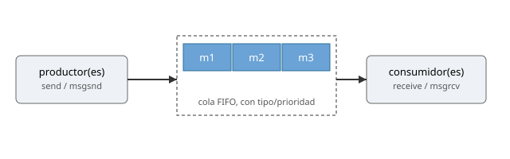
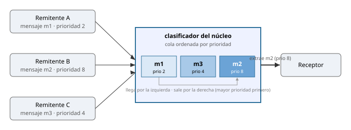
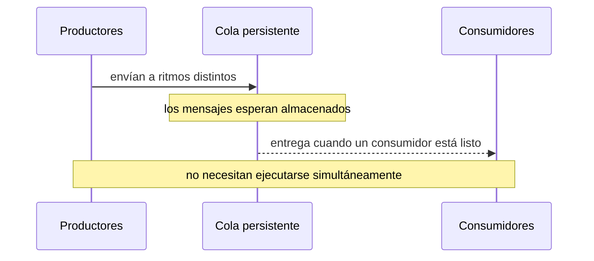
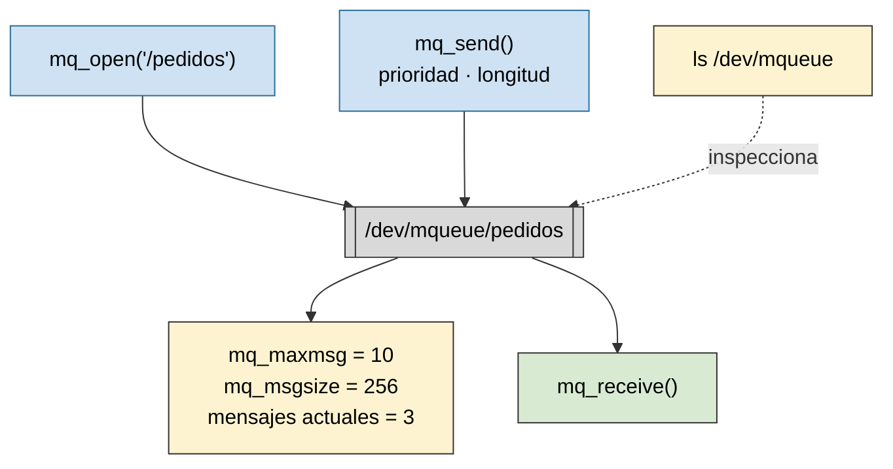
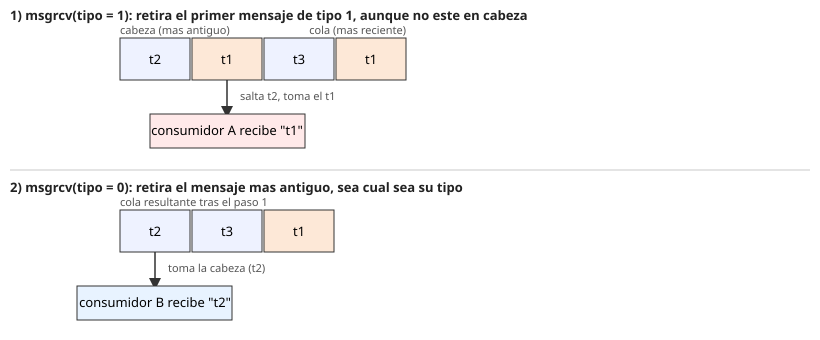

# IPC: colas de mensajes

Práctica asociada: [`PRACTICA/07`](../../PRACTICA/07-colas-de-mensajes/).

## Contenidos

- Comunicación entre procesos por paso de mensajes.
- Colas de mensajes provistas por el sistema operativo. Persistencia y prioridad/tipo de mensaje.
- API POSIX: `mq_open()`, `mq_send()`, `mq_receive()`, `mq_close()`, `mq_unlink()`, atributos de la cola.
- Variante System V (usada en la práctica): `msgget()`, `msgsnd()`, `msgrcv()`, `msgctl()`, tipo de mensaje (`mtype`) para retirada selectiva.
- Envío y recepción bloqueantes y no bloqueantes.
- Inspección: `lsipc`, `/dev/mqueue`, `ipcs -q`.
- Comparación con pipes/fifos y con memoria compartida.

## Esquema de una cola de mensajes

Una cola conserva mensajes completos hasta que un receptor los recoge, y puede ordenarlos por tipo o prioridad: el clasificador del kernel coloca cada mensaje según su prioridad y entrega primero el más prioritario.

*Una cola conserva mensajes completos hasta que un receptor los recoge. Puede distinguirlos por tipo o prioridad.*

## Productores y consumidores desacoplados

El emisor y el receptor no necesitan ejecutarse simultáneamente: la cola actúa como almacenamiento intermedio persistente.

*El emisor y el receptor no necesitan ejecutarse simultáneamente: la cola actúa como almacenamiento intermedio.*

## Una cola POSIX en Linux

Las colas POSIX son objetos administrados por el sistema operativo, con límites de tamaño, persistencia y operaciones bloqueantes o no bloqueantes. En Linux son visibles bajo `/dev/mqueue`.

*Las colas POSIX son objetos administrados por el sistema operativo, con límites de tamaño, persistencia y operaciones bloqueantes o no bloqueantes.*

## Tipo de mensaje y retirada selectiva

Cada mensaje se etiqueta con un tipo (o una prioridad). Un receptor puede limitarse a extraer siempre el mensaje más antiguo de toda la cola (FIFO estricto) o pedir específicamente el primero que coincida con un tipo, saltándose los demás.

*Pidiendo un tipo concreto se retira el primer mensaje de ese tipo, aunque no esté en cabeza; pidiendo cualquier tipo se retira siempre el más antiguo.*

La práctica usa la interfaz **System V** (`msgget`, `msgsnd`, `msgrcv`, `msgctl`), donde ese tipo es un `long` (`mtype`) obligatorio en todo mensaje y `msgrcv` decide con él qué retirar. Es la misma familia de recursos que la memoria compartida y los semáforos (ver [`TEORIA/10`](../10-memoria-compartida-y-mutex/)): identificados con una clave `ftok`, y persistentes hasta que se liberan explícitamente. Detalle completo de la API: [`PRACTICA/07`](../../PRACTICA/07-colas-de-mensajes/).
