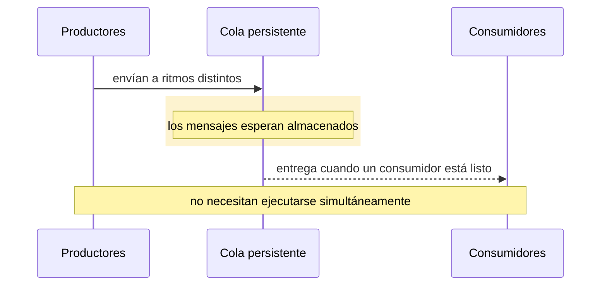
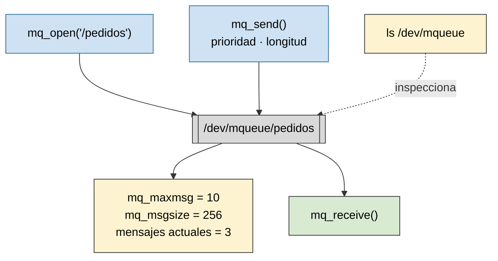

# IPC: colas de mensajes

Práctica asociada: [`PRACTICA/07`](../../PRACTICA/07-colas-de-mensajes/).

## Contenidos

- Comunicación entre procesos por paso de mensajes.
- Colas de mensajes provistas por el sistema operativo. Persistencia y prioridad de mensajes.
- API POSIX: `mq_open()`, `mq_send()`, `mq_receive()`, `mq_close()`, `mq_unlink()`, atributos de la cola.
- Envío y recepción bloqueantes y no bloqueantes.
- Inspección: `lsipc`, `/dev/mqueue`.
- Comparación con pipes/fifos y con memoria compartida.

## Esquema de una cola de mensajes

<svg xmlns="http://www.w3.org/2000/svg" width="560" viewBox="0 0 640 200" font-family="sans-serif" font-size="13" role="img" aria-label="Productores envían mensajes a una cola FIFO con prioridad; los consumidores extraen mensajes completos de la cola">
  <rect width="640" height="200" fill="#ffffff"/>
  <rect x="20" y="70" width="140" height="60" rx="6" fill="#eef2f7" stroke="#666"/>
  <text x="90" y="95" text-anchor="middle">productor(es)</text>
  <text x="90" y="112" text-anchor="middle" font-size="11" fill="#555">send / msgsnd</text>
  <rect x="230" y="55" width="60" height="34" fill="#6ba3d6" stroke="#2b6f99"/><text x="260" y="77" text-anchor="middle" fill="#fff">m1</text>
  <rect x="292" y="55" width="60" height="34" fill="#6ba3d6" stroke="#2b6f99"/><text x="322" y="77" text-anchor="middle" fill="#fff">m2</text>
  <rect x="354" y="55" width="60" height="34" fill="#6ba3d6" stroke="#2b6f99"/><text x="384" y="77" text-anchor="middle" fill="#fff">m3</text>
  <rect x="222" y="45" width="200" height="100" fill="none" stroke="#333" stroke-dasharray="4 3"/>
  <text x="322" y="132" text-anchor="middle" font-size="11" fill="#555">cola FIFO, con tipo/prioridad</text>
  <rect x="460" y="70" width="150" height="60" rx="6" fill="#eef2f7" stroke="#666"/>
  <text x="535" y="95" text-anchor="middle">consumidor(es)</text>
  <text x="535" y="112" text-anchor="middle" font-size="11" fill="#555">receive / msgrcv</text>
  <line x1="160" y1="100" x2="222" y2="100" stroke="#333" stroke-width="2"/><path d="M222 100 l-10 -5 l0 10 z" fill="#333"/>
  <line x1="422" y1="100" x2="460" y2="100" stroke="#333" stroke-width="2"/><path d="M460 100 l-10 -5 l0 10 z" fill="#333"/>
</svg>

Una cola conserva mensajes completos hasta que un receptor los recoge, y puede ordenarlos por tipo o prioridad: el clasificador del núcleo coloca cada mensaje según su prioridad y entrega primero el más prioritario.

<svg xmlns="http://www.w3.org/2000/svg" width="560" viewBox="0 0 700 260" font-family="sans-serif" font-size="12" role="img" aria-label="Tres remitentes envían mensajes con distinta prioridad; el nucleo los coloca en una cola ordenada por prioridad, con el mensaje de mayor prioridad más cerca de la salida; el receptor extrae mensajes completos">
  <rect width="700" height="260" fill="#ffffff"/>
  <rect x="20" y="20" width="170" height="46" rx="6" fill="#eef2f7" stroke="#666"/><text x="105" y="40" text-anchor="middle">Remitente A</text><text x="105" y="56" text-anchor="middle" font-size="11" fill="#555">mensaje m1 · prioridad 2</text>
  <rect x="20" y="107" width="170" height="46" rx="6" fill="#eef2f7" stroke="#666"/><text x="105" y="127" text-anchor="middle">Remitente B</text><text x="105" y="143" text-anchor="middle" font-size="11" fill="#555">mensaje m2 · prioridad 8</text>
  <rect x="20" y="194" width="170" height="46" rx="6" fill="#eef2f7" stroke="#666"/><text x="105" y="214" text-anchor="middle">Remitente C</text><text x="105" y="230" text-anchor="middle" font-size="11" fill="#555">mensaje m3 · prioridad 4</text>
  <rect x="270" y="55" width="250" height="150" fill="#eef2ff" stroke="#2b6f99" stroke-width="2"/>
  <text x="395" y="76" text-anchor="middle" font-weight="bold">clasificador del núcleo</text>
  <text x="395" y="92" text-anchor="middle" font-size="10" fill="#555">cola ordenada por prioridad</text>
  <rect x="282" y="112" width="70" height="42" fill="#dbe9f7" stroke="#2b6f99"/>
  <text x="317" y="132" text-anchor="middle" font-weight="bold">m1</text>
  <text x="317" y="146" text-anchor="middle" font-size="9">prio 2</text>
  <rect x="360" y="112" width="70" height="42" fill="#a8c9e8" stroke="#2b6f99"/>
  <text x="395" y="132" text-anchor="middle" font-weight="bold">m3</text>
  <text x="395" y="146" text-anchor="middle" font-size="9">prio 4</text>
  <rect x="438" y="112" width="70" height="42" fill="#6ba3d6" stroke="#2b6f99"/>
  <text x="473" y="132" text-anchor="middle" font-weight="bold" fill="#fff">m2</text>
  <text x="473" y="146" text-anchor="middle" font-size="9" fill="#fff">prio 8</text>
  <path d="M317,154 L317,170 L473,170 L473,158" stroke="#999" fill="none" marker-end="url(#arrQ)"/>
  <defs><marker id="arrQ" markerWidth="7" markerHeight="7" refX="3" refY="3" orient="auto"><path d="M0,0 L6,3 L0,6 z" fill="#999"/></marker></defs>
  <text x="395" y="183" text-anchor="middle" font-size="9" fill="#777">llega por la izquierda · sale por la derecha (mayor prioridad primero)</text>
  <line x1="190" y1="43" x2="270" y2="120" stroke="#333"/><path d="M270 120 l-10 -3 l3 -8 z" fill="#333"/>
  <line x1="190" y1="130" x2="270" y2="130" stroke="#333"/><path d="M270 130 l-10 -4 l0 8 z" fill="#333"/>
  <line x1="190" y1="217" x2="270" y2="145" stroke="#333"/><path d="M270 145 l-9 4 l-1 -8 z" fill="#333"/>
  <rect x="560" y="107" width="120" height="46" rx="6" fill="#eef2f7" stroke="#666"/><text x="620" y="134" text-anchor="middle">Receptor</text>
  <line x1="520" y1="130" x2="558" y2="130" stroke="#333" stroke-width="2"/><path d="M558 130 l-10 -5 l0 10 z" fill="#333"/>
  <text x="539" y="120" text-anchor="middle" font-size="10" fill="#555">extrae m2 (prio 8)</text>
</svg>

*Una cola conserva mensajes completos hasta que un receptor los recoge. Puede distinguirlos por tipo o prioridad.*

## Productores y consumidores desacoplados

El emisor y el receptor no necesitan ejecutarse simultáneamente: la cola actúa como almacenamiento intermedio persistente.

*El emisor y el receptor no necesitan ejecutarse simultáneamente: la cola actúa como almacenamiento intermedio.*

## Una cola POSIX en Linux

Las colas POSIX son objetos administrados por el sistema operativo, con límites de tamaño, persistencia y operaciones bloqueantes o no bloqueantes. En Linux son visibles bajo `/dev/mqueue`.

*Las colas POSIX son objetos administrados por el sistema operativo, con límites de tamaño, persistencia y operaciones bloqueantes o no bloqueantes.*

Detalle en la práctica: [`PRACTICA/07`](../../PRACTICA/07-colas-de-mensajes/). Figuras catalogadas en [`TEORIA/IMAGENES.md`](../IMAGENES.md).
