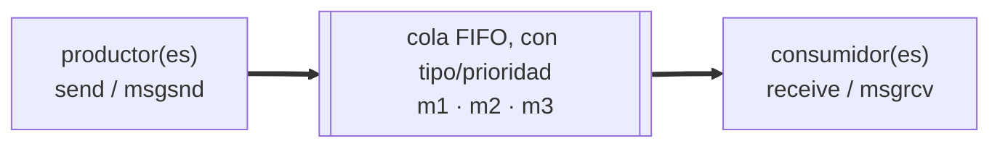

# IPC: colas de mensajes

Práctica asociada: [`PRACTICA/07`](../../PRACTICA/07-colas-de-mensajes/).

## Contenidos

- Comunicación entre procesos por paso de mensajes.
- Colas de mensajes provistas por el sistema operativo. Persistencia y prioridad de
  mensajes.
- API POSIX: `mq_open()`, `mq_send()`, `mq_receive()`, `mq_close()`, `mq_unlink()`,
  atributos de la cola.
- Envío y recepción bloqueantes y no bloqueantes.
- Inspección: `lsipc`, `/dev/mqueue`.
- Comparación con pipes/fifos y con memoria compartida.

## Esquema de una cola de mensajes

Detalle en la práctica: [`PRACTICA/07`](../../PRACTICA/07-colas-de-mensajes/).

## Material

_(pendiente de añadir)_
