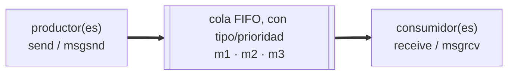
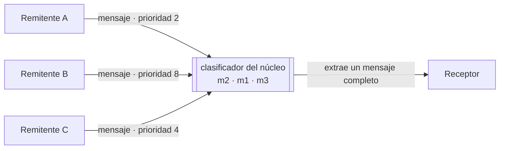
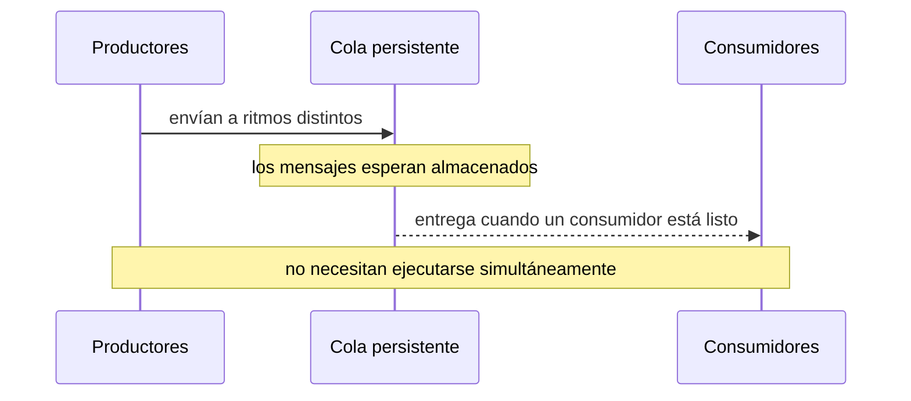
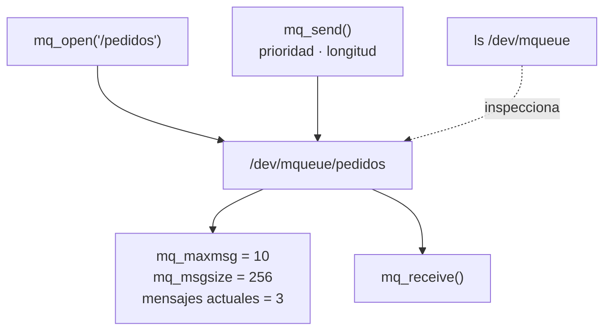

# IPC: colas de mensajes

Práctica asociada: [`PRACTICA/07`](../../PRACTICA/07-colas-de-mensajes/).

## Contenidos

- Comunicación entre procesos por paso de mensajes.
- Colas de mensajes provistas por el sistema operativo. Persistencia y prioridad de mensajes.
- API POSIX: `mq_open()`, `mq_send()`, `mq_receive()`, `mq_close()`, `mq_unlink()`, atributos de la cola.
- Envío y recepción bloqueantes y no bloqueantes.
- Inspección: `lsipc`, `/dev/mqueue`.
- Comparación con pipes/fifos y con memoria compartida.

## Esquema de una cola de mensajes

Detalle en la práctica: [`PRACTICA/07`](../../PRACTICA/07-colas-de-mensajes/).

## Galería visual complementaria

### T09.1 · Una cola como oficina postal

*Una cola conserva mensajes completos hasta que un receptor los recoge. Puede distinguirlos por tipo o prioridad.*

### T09.2 · Productores y consumidores desacoplados

*El emisor y el receptor no necesitan ejecutarse simultáneamente: la cola actúa como almacenamiento intermedio.*

### T09.3 · Una cola POSIX visible en Linux

*Las colas POSIX son objetos administrados por el sistema operativo, con límites de tamaño, persistencia y operaciones bloqueantes o no bloqueantes.*

## Material

Las figuras complementarias de este tema están incluidas en la galería anterior y catalogadas en [`TEORIA/IMAGENES.md`](../IMAGENES.md).
