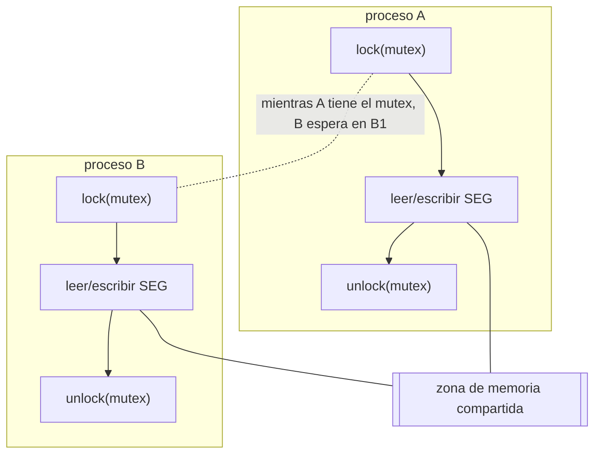
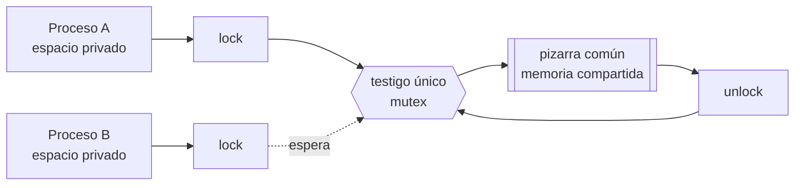
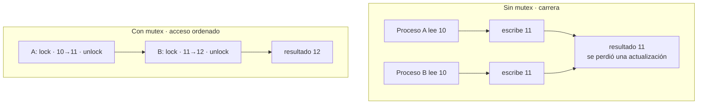
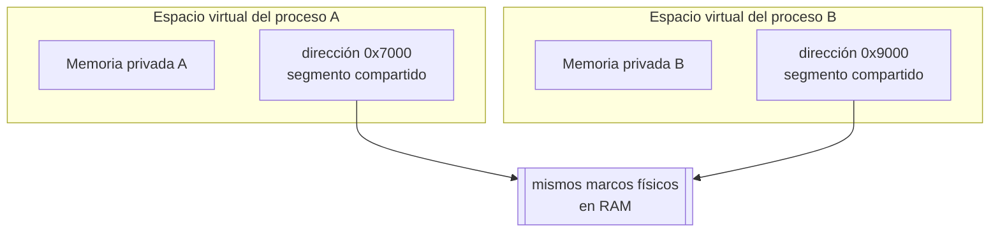

# Memoria compartida y mutex

Práctica asociada: [`PRACTICA/06`](../../PRACTICA/06-memoria-compartida-y-semaforos/).

## Contenidos

- Memoria compartida: acceso de dos o más procesos a una misma zona de memoria.
  Ventajas (rapidez) y riesgo (condiciones de carrera).
- API POSIX: `shm_open()`, `ftruncate()`, `mmap()`, `munmap()`, `shm_unlink()`.
- Necesidad de sincronizar el acceso: exclusión mutua.
- Mutex y semáforos como mecanismo de protección de la región compartida.
- Mutex POSIX (`pthread_mutex_*`) y semáforos POSIX (`sem_open`/`sem_wait`/`sem_post`),
  con y sin nombre, compartidos entre procesos.

## Memoria compartida protegida por un mutex/semáforo

Detalle en la práctica: [`PRACTICA/06`](../../PRACTICA/06-memoria-compartida-y-semaforos/).

## Galería visual complementaria

### T10.1 · Dos procesos ante una misma pizarra

*La memoria compartida evita copiar datos entre procesos, pero obliga a sincronizar los accesos
para impedir escrituras simultáneas.*

### T10.2 · Sin mutex y con mutex

*Compartir memoria aporta velocidad. El mutex aporta el orden necesario para que esa velocidad no
produzca resultados incoherentes.*

### T10.3 · Una sala común mapeada en dos procesos

*Cada proceso conserva su memoria privada, pero el núcleo puede mapear el mismo segmento físico
dentro de varios espacios de direcciones.*

## Material

Las figuras complementarias de este tema están incluidas en la galería anterior y catalogadas en
[`TEORIA/IMAGENES.md`](../IMAGENES.md).
