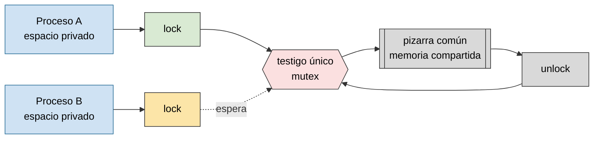
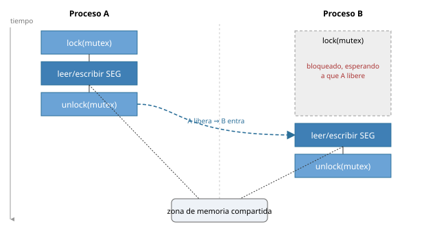
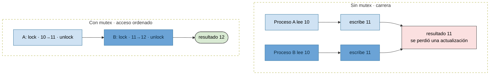
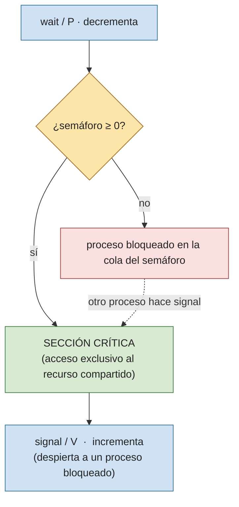
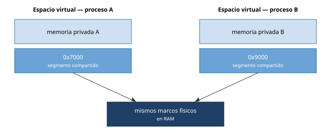

# Memoria compartida y mutex

Práctica asociada: [`PRACTICA/06`](../../PRACTICA/06-memoria-compartida-y-semaforos/).

## Contenidos

- Memoria compartida: acceso de dos o más procesos a una misma zona de memoria. Ventajas (rapidez) y riesgo (condiciones de carrera).
- API POSIX: `shm_open()`, `ftruncate()`, `mmap()`, `munmap()`, `shm_unlink()`.
- Necesidad de sincronizar el acceso: exclusión mutua.
- Mutex y semáforos como mecanismo de protección de la región compartida.
- Mutex POSIX (`pthread_mutex_*`) y semáforos POSIX (`sem_open`/`sem_wait`/`sem_post`), con y sin nombre, compartidos entre procesos.
- Semáforos binarios (0/1, exclusión mutua) y n-arios (0..N, hasta N procesos concurrentes).
- Operaciones atómicas `wait`/`P` y `signal`/`V`, y las tres condiciones que debe garantizar un semáforo.

## Memoria compartida y exclusión mutua

La memoria compartida evita copiar datos entre procesos, pero obliga a sincronizar los accesos para impedir escrituras simultáneas. Un testigo único (el mutex) decide quién puede tocar la pizarra común en cada momento.

*La memoria compartida evita copiar datos entre procesos, pero obliga a sincronizar los accesos para impedir escrituras simultáneas.*

## Memoria compartida protegida por un mutex/semáforo

Sin mutex, dos procesos pueden leer el mismo valor y escribir encima el uno del otro, perdiendo una actualización. Con mutex, los accesos se ordenan y el resultado es coherente.

*Compartir memoria aporta velocidad. El mutex aporta el orden necesario para que esa velocidad no produzca resultados incoherentes.*

## Semáforos: wait y signal

Un semáforo es la generalización del mutex: un contador con dos operaciones atómicas, **wait/P** (decrementa; si el contador quedaría negativo, bloquea al proceso) y **signal/V** (incrementa y despierta a un proceso bloqueado, si lo hay). Debe garantizar tres cosas: exclusión mutua (solo un proceso en la sección crítica), que un proceso fuera de su sección crítica no bloquee a otros, y que el que está dentro no bloquee para siempre al resto.

- **Binarios** (0/1): a 1 permiten el acceso a la sección crítica, a 0 lo bloquean. Es el caso particular que equivale a un mutex.
- **N-arios** (0..N): permiten que hasta N procesos trabajen a la vez en una tarea no crítica (p. ej. varios lectores).

*Un mutex es el caso particular de un semáforo binario usado para exclusión mutua.*

## El mismo segmento en dos espacios de direcciones

Cada proceso conserva su memoria privada, pero el kernel puede mapear (`mmap`) el mismo segmento físico dentro de varios espacios de direcciones, posiblemente en direcciones virtuales distintas.

*Cada proceso conserva su memoria privada, pero el kernel puede mapear el mismo segmento físico dentro de varios espacios de direcciones.*

Detalle en la práctica: [`PRACTICA/06`](../../PRACTICA/06-memoria-compartida-y-semaforos/).
