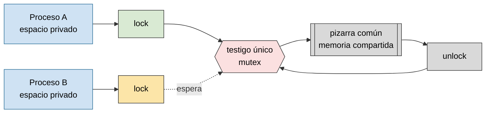
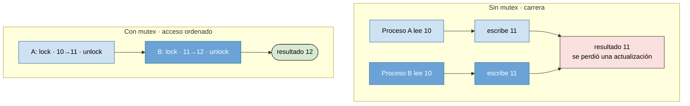

# Memoria compartida y mutex

Práctica asociada: [`PRACTICA/06`](../../PRACTICA/06-memoria-compartida-y-semaforos/).

## Contenidos

- Memoria compartida: acceso de dos o más procesos a una misma zona de memoria. Ventajas (rapidez) y riesgo (condiciones de carrera).
- API POSIX: `shm_open()`, `ftruncate()`, `mmap()`, `munmap()`, `shm_unlink()`.
- Necesidad de sincronizar el acceso: exclusión mutua.
- Mutex y semáforos como mecanismo de protección de la región compartida.
- Mutex POSIX (`pthread_mutex_*`) y semáforos POSIX (`sem_open`/`sem_wait`/`sem_post`), con y sin nombre, compartidos entre procesos.

## Memoria compartida y exclusión mutua

La memoria compartida evita copiar datos entre procesos, pero obliga a sincronizar los accesos para impedir escrituras simultáneas. Un testigo único (el mutex) decide quién puede tocar la pizarra común en cada momento.

*La memoria compartida evita copiar datos entre procesos, pero obliga a sincronizar los accesos para impedir escrituras simultáneas.*

## Memoria compartida protegida por un mutex/semáforo

<svg xmlns="http://www.w3.org/2000/svg" width="520" viewBox="0 0 640 340" font-family="sans-serif" font-size="12" role="img" aria-label="Linea de tiempo vertical: el proceso A bloquea el mutex, trabaja y libera; el proceso B permanece bloqueado durante exactamente ese intervalo y solo entonces empieza su propia sección critica">
  <rect width="640" height="340" fill="#ffffff"/>
  <text x="130" y="24" text-anchor="middle" font-weight="bold">Proceso A</text>
  <text x="500" y="24" text-anchor="middle" font-weight="bold">Proceso B</text>
  <text x="15" y="34" font-size="10" fill="#777">tiempo</text>
  <line x1="15" y1="40" x2="15" y2="320" stroke="#999" marker-end="url(#arrT10t)"/>
  <defs><marker id="arrT10t" markerWidth="7" markerHeight="7" refX="3" refY="6" orient="auto"><path d="M0,0 L6,0 L3,6 z" fill="#999"/></marker></defs>
  <line x1="320" y1="35" x2="320" y2="320" stroke="#ccc" stroke-dasharray="3 3"/>
  <rect x="60" y="45" width="140" height="34" fill="#6ba3d6" stroke="#2b6f99"/><text x="130" y="67" text-anchor="middle" fill="#fff">lock(mutex)</text>
  <line x1="130" y1="79" x2="130" y2="90" stroke="#333"/>
  <rect x="60" y="90" width="140" height="34" fill="#3f7fb5" stroke="#2b6f99"/><text x="130" y="112" text-anchor="middle" fill="#fff">leer/escribir SEG</text>
  <line x1="130" y1="124" x2="130" y2="135" stroke="#333"/>
  <rect x="60" y="135" width="140" height="34" fill="#6ba3d6" stroke="#2b6f99"/><text x="130" y="157" text-anchor="middle" fill="#fff">unlock(mutex)</text>
  <rect x="430" y="45" width="140" height="124" fill="#eeeeee" stroke="#999" stroke-dasharray="4 3"/>
  <text x="500" y="63" text-anchor="middle" font-size="11">lock(mutex)</text>
  <text x="500" y="100" text-anchor="middle" font-size="10" fill="#a33">bloqueado, esperando</text>
  <text x="500" y="114" text-anchor="middle" font-size="10" fill="#a33">a que A libere</text>
  <path d="M200,152 C260,152 260,197 428,197" stroke="#2b6f99" stroke-width="1.6" fill="none" stroke-dasharray="5 3" marker-end="url(#arrT10h)"/>
  <defs><marker id="arrT10h" markerWidth="8" markerHeight="8" refX="6" refY="4" orient="auto"><path d="M0,0 L8,4 L0,8 z" fill="#2b6f99"/></marker></defs>
  <text x="315" y="180" text-anchor="middle" font-size="10" fill="#2b6f99">A libera ⇒ B entra</text>
  <rect x="430" y="180" width="140" height="34" fill="#3f7fb5" stroke="#2b6f99"/><text x="500" y="202" text-anchor="middle" fill="#fff">leer/escribir SEG</text>
  <line x1="500" y1="214" x2="500" y2="225" stroke="#333"/>
  <rect x="430" y="225" width="140" height="34" fill="#6ba3d6" stroke="#2b6f99"/><text x="500" y="247" text-anchor="middle" fill="#fff">unlock(mutex)</text>
  <rect x="250" y="290" width="140" height="34" rx="6" fill="#eef2f7" stroke="#666"/><text x="320" y="312" text-anchor="middle" font-size="11">zona de memoria compartida</text>
  <line x1="130" y1="124" x2="290" y2="290" stroke="#333" stroke-dasharray="2 2"/>
  <line x1="500" y1="214" x2="350" y2="290" stroke="#333" stroke-dasharray="2 2"/>
</svg>

Sin mutex, dos procesos pueden leer el mismo valor y escribir encima el uno del otro, perdiendo una actualización. Con mutex, los accesos se ordenan y el resultado es coherente.

*Compartir memoria aporta velocidad. El mutex aporta el orden necesario para que esa velocidad no produzca resultados incoherentes.*

## El mismo segmento en dos espacios de direcciones

Cada proceso conserva su memoria privada, pero el núcleo puede mapear (`mmap`) el mismo segmento físico dentro de varios espacios de direcciones, posiblemente en direcciones virtuales distintas.

<svg xmlns="http://www.w3.org/2000/svg" width="560" viewBox="0 0 680 280" font-family="sans-serif" font-size="12" role="img" aria-label="Los procesos A y B mapean, en direcciones virtuales distintas, el mismo segmento físico de memoria compartida">
  <rect width="680" height="280" fill="#ffffff"/>
  <text x="150" y="24" text-anchor="middle" font-weight="bold">Espacio virtual — proceso A</text>
  <rect x="30" y="40" width="240" height="50" fill="#cfe0f2" stroke="#3773a0"/><text x="150" y="70" text-anchor="middle">memoria privada A</text>
  <rect x="30" y="100" width="240" height="50" fill="#6ba3d6" stroke="#2b6f99"/><text x="150" y="122" text-anchor="middle" fill="#fff">0x7000</text><text x="150" y="138" text-anchor="middle" fill="#fff" font-size="10">segmento compartido</text>
  <text x="530" y="24" text-anchor="middle" font-weight="bold">Espacio virtual — proceso B</text>
  <rect x="410" y="40" width="240" height="50" fill="#cfe0f2" stroke="#3773a0"/><text x="530" y="70" text-anchor="middle">memoria privada B</text>
  <rect x="410" y="100" width="240" height="50" fill="#6ba3d6" stroke="#2b6f99"/><text x="530" y="122" text-anchor="middle" fill="#fff">0x9000</text><text x="530" y="138" text-anchor="middle" fill="#fff" font-size="10">segmento compartido</text>
  <rect x="220" y="210" width="240" height="50" fill="#1f3f66" stroke="#132840"/><text x="340" y="232" text-anchor="middle" fill="#fff">mismos marcos físicos</text><text x="340" y="248" text-anchor="middle" fill="#fff" font-size="10">en RAM</text>
  <line x1="150" y1="150" x2="280" y2="210" stroke="#333"/><path d="M280 210 l-10 -2 l2 -8 z" fill="#333"/>
  <line x1="530" y1="150" x2="400" y2="210" stroke="#333"/><path d="M400 210 l10 -2 l-2 -8 z" fill="#333"/>
</svg>

*Cada proceso conserva su memoria privada, pero el núcleo puede mapear el mismo segmento físico dentro de varios espacios de direcciones.*

Detalle en la práctica: [`PRACTICA/06`](../../PRACTICA/06-memoria-compartida-y-semaforos/). Figuras catalogadas en [`TEORIA/IMAGENES.md`](../IMAGENES.md).
