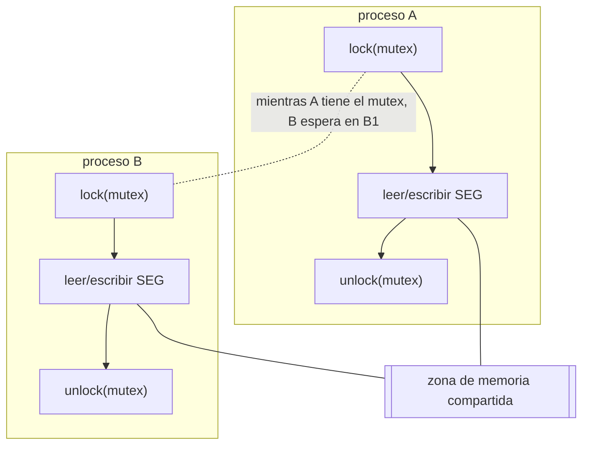

# Memoria compartida y mutex

Práctica asociada: [`PRACTICA/06`](../../PRACTICA/06-memoria-compartida-y-semaforos/).

## Contenidos

- Memoria compartida: acceso de dos o más procesos a una misma zona de memoria.
  Ventajas (rapidez) y riesgo (condiciones de carrera).
- API POSIX: `shm_open()`, `ftruncate()`, `mmap()`, `munmap()`, `shm_unlink()`.
- Necesidad de sincronizar el acceso: exclusión mutua.
- Mutex y semáforos como mecanismo de protección de la región compartida.
- Mutex POSIX (`pthread_mutex_*`) y semáforos POSIX (`sem_open`/`sem_wait`/`sem_post`),
  con y sin nombre, compartidos entre procesos.

## Memoria compartida protegida por un mutex/semáforo

Detalle en la práctica: [`PRACTICA/06`](../../PRACTICA/06-memoria-compartida-y-semaforos/).

## Material

_(pendiente de añadir)_
