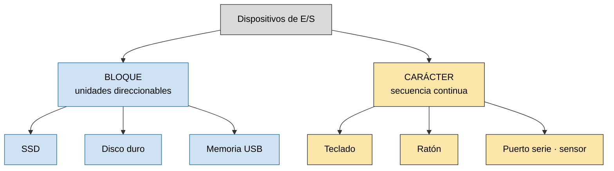
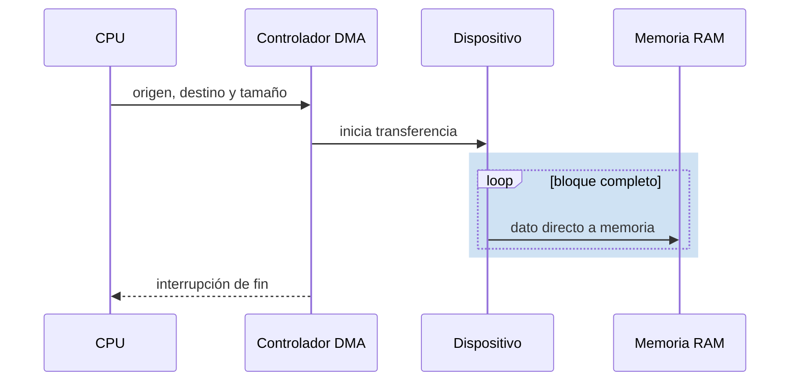
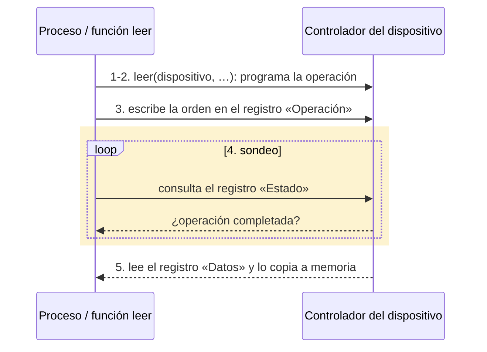
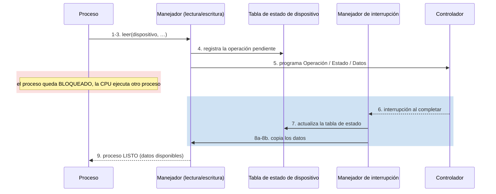
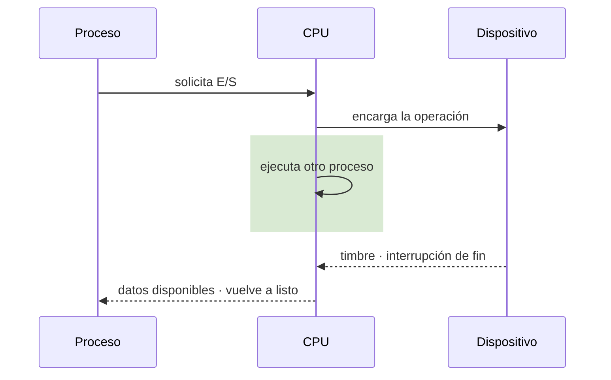

# Tema 7: Dispositivos de Entrada/Salida

7.1 Conceptos básicos · 7.2 Funciones de entrada/salida · 7.3 Almacenamiento intermedio · 7.4 Tipos de discos duros · 7.5 Planificación de discos · 7.6 Caché de disco · 7.7 Entrada/salida en Linux.

---

## 7.1 Conceptos básicos

- Los **controladores** son la interfaz **software** entre el hardware del dispositivo y el sistema operativo.
- Para lograr **homogeneidad** en el conjunto de instrucciones que el SO puede invocar sobre un dispositivo, se dispone de **manejadores de dispositivos**: un conjunto de funciones que abstraen el funcionamiento de un controlador concreto.
- Se construyen **APIs** con las funciones básicas de acceso a un dispositivo: `open`, `close`, `control`, `seek`… El manejador exporta al SO una **interfaz común de llamadas al sistema** para los dispositivos.

<svg xmlns="http://www.w3.org/2000/svg" viewBox="0 0 420 300" font-family="sans-serif" font-size="12" role="img" aria-label="Pirámide de capas de la E/S: de abajo arriba, controladores y manejadores de interrupciones, manejadores de dispositivos, rutinas del sistema operativo y programas de usuario">
  <rect width="420" height="300" fill="#ffffff"/>
  <defs>
    <marker id="t11-01-arrow" markerWidth="8" markerHeight="8" refX="4" refY="4" orient="auto">
      <path d="M0,0 L8,4 L0,8 Z" fill="#333"/>
    </marker>
  </defs>
  <polygon points="210,20 257.5,85 162.5,85" fill="#dcebc9" stroke="#333"/>
  <polygon points="162.5,85 257.5,85 305,150 115,150" fill="#cfd6f5" stroke="#333"/>
  <polygon points="115,150 305,150 352.5,215 67.5,215" fill="#f7d9a8" stroke="#333"/>
  <polygon points="67.5,215 352.5,215 400,280 20,280" fill="#faf3b0" stroke="#333"/>
  <text x="210" y="56" text-anchor="middle">Programas</text>
  <text x="210" y="70" text-anchor="middle">de usuario</text>
  <text x="210" y="121" text-anchor="middle">Rutinas del sistema</text>
  <text x="210" y="135" text-anchor="middle">operativo</text>
  <text x="210" y="186" text-anchor="middle">Manejadores de</text>
  <text x="210" y="200" text-anchor="middle">dispositivos</text>
  <text x="210" y="245" text-anchor="middle">Controladores y manejadores</text>
  <text x="210" y="259" text-anchor="middle">de interrupciones</text>
  <line x1="30" y1="278" x2="30" y2="22" stroke="#333" marker-end="url(#t11-01-arrow)"/>
  <text x="12" y="288" font-size="10">HW</text>
  <text x="8" y="18" font-size="10">apps</text>
</svg>

- Las operaciones de lectura y escritura son **secuenciales**. Interesa **paralelizar** al máximo las actividades de las aplicaciones durante los intervalos de acceso a los dispositivos ⇒ **solapamiento de E/S y procesador**. Requisitos:
  - El lenguaje de programación y el SO deben permitir que el hilo **inicie** una operación de E/S y **sondee** si ha concluido.
  - El hilo debe poder realizar otros trabajos mientras se llevan a cabo las operaciones de E/S.

### Características de los dispositivos

- **Unidad de transferencia**: los datos pueden intercambiarse como flujos de bytes/caracteres de longitud variable (**dispositivos modo carácter**, p. ej. teclado) o como flujos de bloques de tamaño fijo (**dispositivos modo bloque**, p. ej. disco duro).
- **Velocidad de transmisión**: muy variable según la naturaleza del dispositivo.
- **Utilidad**, **complejidad de control** y **representación de los datos**.



*Los dispositivos de bloque transfieren unidades direccionables de datos; los de carácter producen o consumen secuencias continuas.*

## 7.2 Funciones de entrada/salida

- El acceso mediante **E/S directa** transfiere los datos de entrada desde el controlador a un registro de la CPU y de éste a memoria principal (ídem para la salida).
- El acceso mediante **DMA** transfiere los datos entre el controlador y la memoria principal **directamente**.
- Si el dispositivo dispone de **interrupciones**, el software no necesita recurrir a operaciones periódicas de **sondeo**.



*El acceso directo a memoria (DMA) permite transferir bloques sin que la CPU tenga que copiar personalmente cada palabra.*

**Estrategias de acceso**: E/S directa con sondeo · E/S por DMA con sondeo *(muy poco frecuente)* · E/S directa con interrupciones · E/S por DMA con interrupciones.

### E/S con sondeo (lectura)

El proceso solicita la lectura y **espera activamente** consultando el registro de estado del controlador hasta que el dato está disponible:



### E/S dirigida por interrupciones

El proceso se **bloquea** tras lanzar la operación; el controlador avisa con una interrupción al terminar:



En lugar de consultar continuamente al dispositivo, el procesador puede dedicarse a otro proceso y recibir una interrupción («timbre») cuando la operación de E/S ha concluido:



*En lugar de consultar continuamente al dispositivo, el procesador recibe una interrupción cuando la operación de E/S ha concluido.*

### Gestor general de interrupciones

1. Guarda el **contexto** del proceso en ejecución (contenido de los registros del procesador).
2. Determina el **tipo** de interrupción (sondeo o interrupciones vectorizadas).
3. Llama a la **rutina de servicio de interrupción** específica.

### Modelo de tiempos

| Componente | Significado |
|-----------|-------------|
| `tiempo_cómputo` | tiempo invertido en el cómputo |
| `tiempo_dispositivo` | tiempo invertido en las operaciones de E/S |
| `tiempo_sobrecarga` | tiempo que el proceso invierte en determinar cuándo se completa cada operación de E/S |
| `tiempo_sondeo` | tiempo que el proceso invierte en determinar la finalización de la E/S **con sondeo** |
| `tiempo_manejador` | tiempo acumulado en ejecutar el manejador de interrupciones y las rutinas de manejo del dispositivo |
| `tiempo_listo` | tiempo que el proceso acumula esperando para usar la CPU al concluir la E/S |

```text
tiempo_total = tiempo_cómputo + tiempo_dispositivo + tiempo_sobrecarga

E/S con sondeo:          tiempo_sobrecarga = tiempo_sondeo
E/S con interrupciones:  tiempo_sobrecarga = tiempo_manejador + tiempo_listo

   tiempo_sondeo  >  tiempo_manejador + tiempo_listo
```

Con varios hilos de ejecución y solapamiento mediante interrupciones, el `tiempo_total` deja de ser la suma de los `tiempo_total` individuales: mientras un hilo hace E/S (`tiempo_dispositivo`), otro computa (`tiempo_cómputo`). **Al emplear interrupciones se reduce el tiempo medio de ejecución de cada proceso.**

## 7.3 Almacenamiento intermedio

Un **búfer** es un almacenamiento en memoria principal que se emplea en la gestión de dispositivos de E/S para **mantener su ocupación** cuando un proceso no solicita operaciones de E/S, de modo que se **solapan** el funcionamiento del dispositivo y de la CPU. Permite realizar tareas en paralelo y reducir los tiempos de espera.

- **Búfer de entrada**: almacena en MP los datos leídos del dispositivo de entrada.
- **Búfer de salida**: almacena en MP los datos a volcar sobre un dispositivo de salida.
- Los **búferes hardware** están en el **controlador** del dispositivo (registros electrónicos).
- Los sistemas de **doble búfer** disponen de búferes **hardware** en el controlador y de búferes **software** en el manejador del dispositivo.

<svg xmlns="http://www.w3.org/2000/svg" viewBox="0 0 520 260" font-family="sans-serif" font-size="12" role="img" aria-label="Doble búfer: mientras el dispositivo llena un búfer, el proceso vacía el otro; los papeles se alternan en el instante siguiente">
  <rect width="520" height="260" fill="#ffffff"/>
  <defs>
    <marker id="t11-04-o" markerWidth="8" markerHeight="8" refX="4" refY="4" orient="auto"><path d="M0,0 L8,4 L0,8 Z" fill="#c0632b"/></marker>
    <marker id="t11-04-b" markerWidth="8" markerHeight="8" refX="4" refY="4" orient="auto"><path d="M0,0 L8,4 L0,8 Z" fill="#2b5ac0"/></marker>
  </defs>
  <rect x="10" y="95" width="100" height="50" rx="4" fill="#eeeeee" stroke="#333"/>
  <text x="60" y="124" text-anchor="middle">Dispositivo</text>
  <rect x="150" y="55" width="220" height="150" rx="4" fill="none" stroke="#666" stroke-dasharray="3,2"/>
  <text x="260" y="45" text-anchor="middle" font-size="11">Controlador + manejador (búferes HW/SW)</text>
  <rect x="170" y="75" width="80" height="45" fill="#fde3c0" stroke="#b56a1f"/>
  <text x="210" y="102" text-anchor="middle">A</text>
  <rect x="270" y="140" width="80" height="45" fill="#cfe0fb" stroke="#2b5ac0"/>
  <text x="310" y="167" text-anchor="middle">B</text>
  <ellipse cx="460" cy="130" rx="45" ry="30" fill="#eeeeee" stroke="#333"/>
  <text x="460" y="134" text-anchor="middle">Proceso</text>
  <path d="M110,110 L168,95" stroke="#c0632b" stroke-width="2" marker-end="url(#t11-04-o)" fill="none"/>
  <path d="M350,155 L418,138" stroke="#c0632b" stroke-width="2" marker-end="url(#t11-04-o)" fill="none"/>
  <path d="M110,130 L268,160" stroke="#2b5ac0" stroke-width="2" stroke-dasharray="5,3" marker-end="url(#t11-04-b)" fill="none"/>
  <path d="M250,90 L418,122" stroke="#2b5ac0" stroke-width="2" stroke-dasharray="5,3" marker-end="url(#t11-04-b)" fill="none"/>
  <text x="20" y="225" fill="#c0632b">— instante t: dispositivo llena A · proceso vacía B</text>
  <text x="20" y="245" fill="#2b5ac0">- - instante t+1: dispositivo llena B · proceso vacía A</text>
</svg>

## 7.4 Tipos de discos duros

| Tipo | Descripción |
|------|-------------|
| **HDD** (*Hard Disk Drive*), discos magnéticos | Dispositivos mecánicos de superficies giratorias; gran capacidad a coste reducido, pero más lentos y frágiles. |
| **SSD** (*Solid State Drive*), estado sólido | Usan chips de memoria flash; más rápidos, duraderos, silenciosos y de menor consumo, pero más caros. La interfaz **NVMe** es un SSD ultrarrápido para conexión directa a la placa base. |
| **SSHD**, híbridos | Combinan ambas tecnologías; sus prestaciones dependen de la cantidad de memoria flash, dedicada a los datos de acceso más frecuente. |

**Tipos de conexión**: **SATA** (discos internos) · **NVMe** (SSD de alta velocidad, placa base) · **USB** (discos externos) · **tarjetas SD** (externos).

## 7.5 Planificación de discos

### Geometría del disco

En un disco magnético, el tiempo de acceso depende del movimiento del cabezal (unido al brazo actuador) y de la rotación de los platos necesaria para alcanzar el sector.


<sub>Fuente: © Raimond Spekking / CC BY-SA 4.0, vía Wikimedia Commons. [Ficha y licencia](https://commons.wikimedia.org/wiki/File:Seagate_ST9300AG_-_opened._Platter_and_head_mechanics-9324.jpg).</sub>

- Los discos magnéticos se organizan en **placas** de discos físicos, cada uno con una o dos **superficies** de almacenamiento.
- Cada superficie se divide lógicamente en **sectores** (porciones angulares del círculo, del mismo tamaño en bytes) y en **pistas** (anillos concéntricos).
- La intersección de una pista con un sector es el **sector de pista**.
- Para leer/escribir se precisa: que el disco esté **girando**, **posicionar la cabeza** en la pista seleccionada, **posicionarla sobre el sector** seleccionado y **leer/escribir** los datos.
- Las cabezas de lectura/escritura están unidas a un **mismo brazo** y se mueven en paralelo (un único motor). El conjunto de pistas sobre el que se sitúan todas las cabezas para cada superficie —al que se accede **sin mover las cabezas**— se denomina **cilindro**.
- El número de bloques (registros físicos) del disco viene dado por el número de pistas, sectores y superficies.

<svg xmlns="http://www.w3.org/2000/svg" viewBox="0 0 420 300" font-family="sans-serif" font-size="13" role="img" aria-label="Superficie de un disco dividida en pistas concéntricas y sectores angulares">
  <rect width="420" height="300" fill="#ffffff"/>
  <g transform="translate(150,160)">
    <circle r="120" fill="#2f8f8f" stroke="#1f6060"/>
    <circle r="90" fill="none" stroke="#bfe3e3"/>
    <circle r="60" fill="none" stroke="#bfe3e3"/>
    <circle r="30" fill="none" stroke="#bfe3e3"/>
    <circle r="16" fill="#1f6fd0" stroke="#144a90"/>
    <!-- radios (sectores) -->
    <g stroke="#bfe3e3">
      <line x1="0" y1="0" x2="0" y2="-120"/>
      <line x1="0" y1="0" x2="104" y2="-60"/>
      <line x1="0" y1="0" x2="104" y2="60"/>
      <line x1="0" y1="0" x2="0" y2="120"/>
      <line x1="0" y1="0" x2="-104" y2="60"/>
      <line x1="0" y1="0" x2="-104" y2="-60"/>
    </g>
    <!-- un sector resaltado -->
    <path d="M0 0 L0 -120 A120 120 0 0 1 104 -60 Z" fill="#ffe14d" fill-opacity="0.7" stroke="#b59a00"/>
  </g>
  <text x="300" y="70" font-size="12">sector (porción angular)</text>
  <line x1="300" y1="75" x2="235" y2="95" stroke="#333"/>
  <text x="300" y="175" font-size="12">pista (anillo concéntrico)</text>
  <line x1="300" y1="170" x2="238" y2="150" stroke="#333"/>
  <text x="300" y="255" font-size="12">eje / centro del disco</text>
  <line x1="300" y1="250" x2="160" y2="165" stroke="#333"/>
</svg>

### Tiempo de acceso a disco

```text
t_total = t_posicionamiento + t_rotación + t_transferencia
```

- **Tiempo de búsqueda o posicionamiento**: tiempo que tarda la cabeza en posicionarse sobre la pista de acceso.
- **Retardo de rotación o latencia**: tiempo desde que la cabeza está en la pista hasta que el bloque de datos pasa por debajo de la cabeza.
- **Tiempo de transferencia**: tiempo en transferir los datos entre el disco y la memoria.

### Algoritmos de planificación

Para todos los ejemplos, cola de **peticiones: 76, 124, 17, 269, 201, 29, 137, 12** con la cabeza inicialmente en la pista **76**.

#### FCFS — *first come, first served*

Las solicitudes se sirven en el **orden de llegada** al manejador. Recorrido total: **880** pistas.

<svg xmlns="http://www.w3.org/2000/svg" viewBox="0 0 480 300" font-family="sans-serif" font-size="12" role="img" aria-label="Movimiento de la cabeza con FCFS: 76, 124, 17, 269, 201, 29, 137, 12">
  <rect width="480" height="300" fill="#ffffff"/>
  <line x1="55" y1="20" x2="55" y2="250" stroke="#333"/>
  <line x1="55" y1="250" x2="460" y2="250" stroke="#333"/>
  <text x="10" y="25">300</text><text x="20" y="250">0</text>
  <!-- escala vertical: pista 0 -> y250, pista 300 -> y20; y = 250 - pista*(230/300) -->
  <!-- puntos en x acumulado: 0,48,155,407,475,647,755,880 -> x = 55 + cum*(400/880) -->
  <polyline fill="none" stroke="#2b4a8b" stroke-width="1.6"
    points="55,192 77,155 104,237 240,44 271,96 348,228 396,145 462,241"/>
  <g fill="#c0392b">
    <circle cx="55" cy="192" r="3"/><circle cx="77" cy="155" r="3"/><circle cx="104" cy="237" r="3"/>
    <circle cx="240" cy="44" r="3"/><circle cx="271" cy="96" r="3"/><circle cx="348" cy="228" r="3"/>
    <circle cx="396" cy="145" r="3"/><circle cx="462" cy="241" r="3"/>
  </g>
  <g fill="#333">
    <text x="45" y="188">76</text><text x="80" y="150">124</text><text x="108" y="240">17</text>
    <text x="244" y="42">269</text><text x="275" y="94">201</text><text x="352" y="232">29</text>
    <text x="400" y="142">137</text><text x="452" y="238">12</text>
  </g>
</svg>

#### SSTF — *shortest seek time first*

Se sirven antes las solicitudes que requieren un **menor tiempo de búsqueda**. Minimiza el tiempo de búsqueda, pero puede producir **inanición** (*starvation*). Orden de servicio: `76 → 29 → 17 → 12 → 124 → 137 → 201 → 269`. Recorrido total: **321** pistas.

<svg xmlns="http://www.w3.org/2000/svg" viewBox="0 0 480 300" font-family="sans-serif" font-size="12" role="img" aria-label="Movimiento de la cabeza con SSTF: 76, 29, 17, 12, 124, 137, 201, 269">
  <rect width="480" height="300" fill="#ffffff"/>
  <line x1="55" y1="20" x2="55" y2="250" stroke="#333"/>
  <line x1="55" y1="250" x2="460" y2="250" stroke="#333"/>
  <text x="10" y="25">300</text><text x="20" y="250">0</text>
  <!-- cum: 0,47,59,64,176,189,253,321 -> x = 55 + cum*(400/321) ; pistas 76,29,17,12,124,137,201,269 -->
  <polyline fill="none" stroke="#2b4a8b" stroke-width="1.6"
    points="55,192 114,228 130,237 135,241 194,155 210,145 260,96 384,44"/>
  <g fill="#c0392b">
    <circle cx="55" cy="192" r="3"/><circle cx="114" cy="228" r="3"/><circle cx="130" cy="237" r="3"/>
    <circle cx="135" cy="241" r="3"/><circle cx="194" cy="155" r="3"/><circle cx="210" cy="145" r="3"/>
    <circle cx="260" cy="96" r="3"/><circle cx="384" cy="44" r="3"/>
  </g>
  <g fill="#333">
    <text x="45" y="188">76</text><text x="106" y="244">29</text><text x="118" y="252">17</text>
    <text x="138" y="255">12</text><text x="180" y="152">124</text><text x="204" y="140">137</text>
    <text x="264" y="94">201</text><text x="388" y="42">269</text>
  </g>
</svg>

#### Barrido (SCAN) e Inspección (LOOK)

- **SCAN**: la cabeza comienza en la pista 0 y **barre todas las pistas** de abajo arriba y de arriba abajo, atendiendo las peticiones conforme alcanza las pistas deseadas. Al alcanzar la **última pista** invierte la dirección.
- **LOOK**: como SCAN, pero al alcanzar la **pista más alta de las seleccionadas** (no la última física) invierte la dirección.
- **Barrido/inspección circular (C‑SCAN / C‑LOOK)**: el barrido se produce **siempre en el mismo sentido**, de forma circular; se reducen los tiempos de espera al evitar que la cabeza vaya y regrese hasta alcanzar la posición deseada.

Recorridos totales para la cola del ejemplo: **LOOK ≈ 512** · **SCAN ≈ 512** (con vuelta a extremo) · **C‑LOOK** y **C‑SCAN** reducen la espera media al recorrer siempre en el mismo sentido.

SCAN reduce movimientos atendiendo las solicitudes de disco mientras la cabeza avanza en una dirección, de forma parecida a un ascensor que recoge pasajeros según sube y no cambia de sentido hasta llegar al extremo:

<svg xmlns="http://www.w3.org/2000/svg" viewBox="0 0 480 300" font-family="sans-serif" font-size="12" role="img" aria-label="Movimiento de la cabeza con SCAN en forma de ascensor: 10, 22, 35, 61, 88, extremo, invierte sentido, 74, 40">
  <rect width="480" height="300" fill="#ffffff"/>
  <line x1="55" y1="20" x2="55" y2="250" stroke="#333"/>
  <line x1="55" y1="250" x2="460" y2="250" stroke="#333"/>
  <text x="15" y="25">pista</text>
  <text x="20" y="250">0</text>
  <polyline fill="none" stroke="#2b4a8b" stroke-width="1.6"
    points="55,229 112,204 169,177 226,123 284,66 341,41 398,95 455,166"/>
  <g fill="#c0392b">
    <circle cx="55" cy="229" r="3"/><circle cx="112" cy="204" r="3"/><circle cx="169" cy="177" r="3"/>
    <circle cx="226" cy="123" r="3"/><circle cx="284" cy="66" r="3"/>
    <circle cx="398" cy="95" r="3"/><circle cx="455" cy="166" r="3"/>
  </g>
  <circle cx="341" cy="41" r="4" fill="none" stroke="#c0392b" stroke-width="1.5"/>
  <g fill="#333">
    <text x="45" y="225">10</text><text x="102" y="200">22</text><text x="159" y="173">35</text>
    <text x="216" y="119">61</text><text x="274" y="62">88</text>
    <text x="316" y="34">extremo</text>
    <text x="388" y="91">74</text><text x="445" y="180">40</text>
  </g>
  <text x="170" y="270" font-size="11">orden de atención →</text>
  <line x1="284" y1="55" x2="341" y2="45" stroke="#999" stroke-dasharray="2,2"/>
  <text x="345" y="20" font-size="11" fill="#666">invierte el sentido</text>
</svg>

*SCAN reduce movimientos atendiendo las solicitudes de disco mientras la cabeza avanza en una dirección, de forma parecida a un ascensor.*

## 7.6 Caché de disco

Es un conjunto de **búferes de memoria**, cada uno del tamaño de un bloque de disco. Cuando un proceso quiere acceder a un bloque, el **sistema de ficheros** (parte del SO) busca primero una copia en la caché:

- Si la **localiza**, devuelve al proceso el número del búfer correspondiente.
- Si **no**, busca un búfer desocupado o, si no hay libres, selecciona el que lleva **más tiempo sin usarse** (LRU) y lo sustituye por el bloque pedido, leído del disco. El búfer reemplazado se **graba a disco** antes si es necesario.

Como la memoria es mucho más rápida que el disco y los bloques más frecuentes se leen (salvo la primera vez) de memoria principal, se **reduce el tiempo de E/S**.

## 7.7 Entrada/salida en UNIX

<svg xmlns="http://www.w3.org/2000/svg" viewBox="0 0 420 260" font-family="sans-serif" font-size="12" role="img" aria-label="Capas de E/S en UNIX: programas y aplicaciones, herramientas del sistema, kernel y hardware">
  <rect width="420" height="260" fill="#ffffff"/>
  <defs><marker id="t11-05-a" markerWidth="8" markerHeight="8" refX="4" refY="4" orient="auto"><path d="M0,0 L8,4 L0,8 Z" fill="#333"/></marker></defs>
  <rect x="40" y="20" width="340" height="45" fill="#dcebc9" stroke="#333"/>
  <text x="210" y="47" text-anchor="middle">Programas y aplicaciones de otros niveles</text>
  <rect x="40" y="75" width="340" height="65" fill="#cfd6f5" stroke="#333"/>
  <text x="210" y="93" text-anchor="middle">Programas de sistema y de aplicación</text>
  <rect x="55" y="102" width="150" height="28" fill="#ffffff" stroke="#666"/>
  <text x="130" y="121" text-anchor="middle" font-size="11">cc (cpp · comp · as · ld)</text>
  <rect x="215" y="102" width="150" height="28" fill="#ffffff" stroke="#666"/>
  <text x="290" y="121" text-anchor="middle" font-size="11">sh · a.out · date · vi · …</text>
  <rect x="40" y="150" width="340" height="45" fill="#f7d9a8" stroke="#333"/>
  <text x="210" y="177" text-anchor="middle">Kernel</text>
  <rect x="40" y="205" width="340" height="45" fill="#faf3b0" stroke="#333"/>
  <text x="210" y="232" text-anchor="middle">Hardware</text>
  <line x1="210" y1="65" x2="210" y2="75" stroke="#333" marker-end="url(#t11-05-a)"/>
  <line x1="210" y1="140" x2="210" y2="150" stroke="#333" marker-end="url(#t11-05-a)"/>
  <line x1="210" y1="195" x2="210" y2="205" stroke="#333" marker-end="url(#t11-05-a)"/>
</svg>

- **Dispositivos orientados a bloques**: se pueden **direccionar** (el programador puede leer o escribir cualquier bloque tras una operación de posicionamiento); emplean bloques de **tamaño fijo** (512 o 1024 bytes). Ejemplos: discos duros, la memoria, discos compactos, unidades de cinta.
- **Dispositivos orientados a caracteres**: trabajan con secuencias de bytes sin agrupación; **no son direccionables**; funcionan byte a byte. Ejemplos: teclado, pantalla, impresora.
- UNIX emplea programas especiales en C, los **manejadores** (*drivers*), para atender a cada familia de dispositivos. Los procesos se comunican con los dispositivos mediante llamadas a su manejador, que **aparece como si fuera un archivo** en el que se lee o escribe (gran homogeneidad).
- Cada dispositivo se estructura con **descriptores**:
  - **número mayor** (*major number*): asigna el manejador, correspondiente a una familia de dispositivos.
  - **número menor** (*minor number*): pasa al manejador como argumento y le sirve para acceder a uno de varios dispositivos físicos semejantes.
  - **clase**: de bloque o de caracteres.
- Las rutinas de E/S son **independientes de los dispositivos** y de los tipos de acceso: no hay distinción entre acceso aleatorio y secuencial, ni un tamaño de registro lógico impuesto.
- El sistema mantiene una lista de **búferes** asignados a los dispositivos de bloques; el *kernel* los usa para reducir el tráfico de E/S. Cuando un programa solicita una transferencia, se busca primero en los búferes internos por si el bloque ya está en memoria (por una lectura anterior); si es así, no se realiza la operación física.

---

## Material gráfico

Las figuras de este tema están integradas en el texto y catalogadas en [`TEORIA/IMAGENES.md`](../IMAGENES.md). Queda como **material fotográfico** adicional (ilustrativo): las fotos de discos HDD/SSD/NVMe y de conectores SATA/USB/SD y el render 3D del disco con pistas y sectores.
