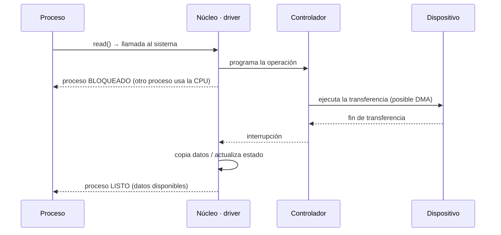
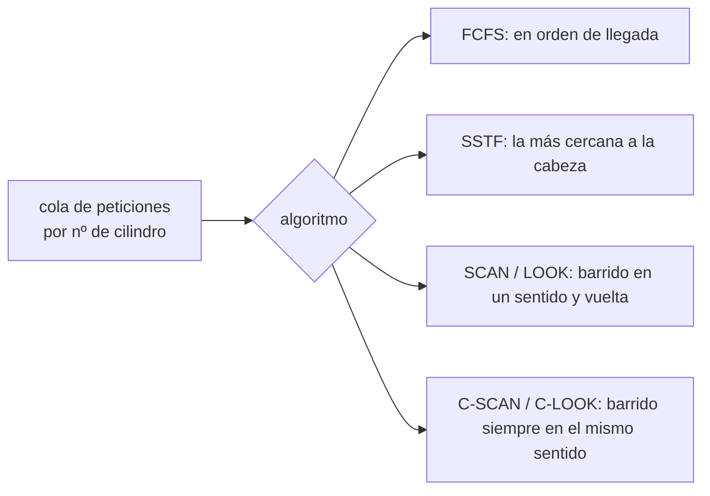

# Dispositivos de E/S

## Contenidos

- Conceptos básicos: controladores como interfaz software entre el hardware y el SO.
  Dispositivos de bloque y de carácter.
- Funciones de entrada/salida: E/S programada, dirigida por interrupciones y por acceso
  directo a memoria (DMA).
- Almacenamiento intermedio (*buffering*).
- Tipos de discos duros y geometría (cilindro, cabeza, sector).
- Planificación de discos: FCFS, SSTF, SCAN, C-SCAN, LOOK, C-LOOK.
- Caché de disco.
- Entrada/salida en Linux.

## E/S dirigida por interrupciones

## Planificación de disco

## Material

_(pendiente de añadir)_
