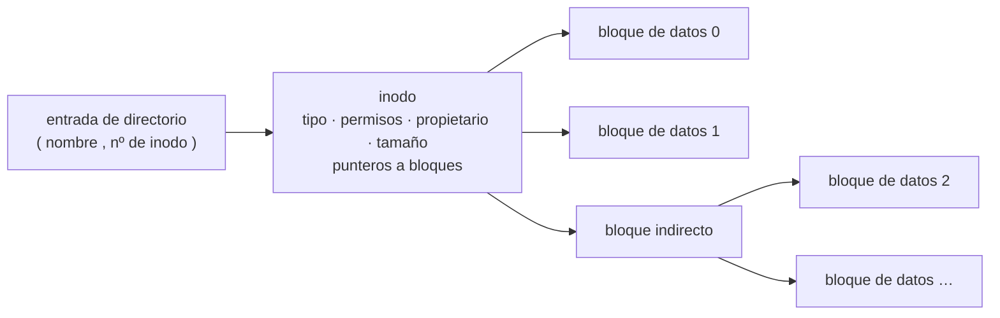
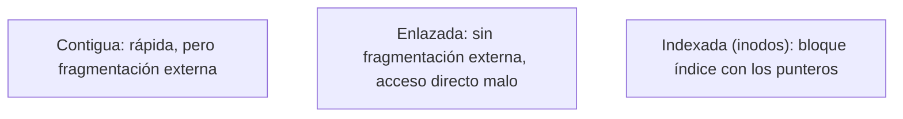

# Sistemas de ficheros

## Contenidos

- Abstracción del sistema de ficheros: un archivo como conjunto de datos con nombre en un
  dispositivo de almacenamiento permanente.
- Conceptos de fichero y directorio. Tipos de fichero (ordinarios, directorios, especiales).
- Nombrado del fichero, propietarios y permisos (usuario/grupo/otros; lectura/escritura/
  ejecución; `chmod`, `chown`).
- Estructura y almacenamiento del fichero: asignación contigua, enlazada e indexada;
  inodos; bloques y gestión del espacio libre.
- Seguridad en los sistemas de ficheros: listas de control de acceso, cifrado.
- Sistemas de ficheros concretos (ext4, FAT, NTFS…) y el VFS de Linux.

## Del nombre al contenido: directorio → inodo → bloques

## Estrategias de asignación

## Material

_(pendiente de añadir)_
