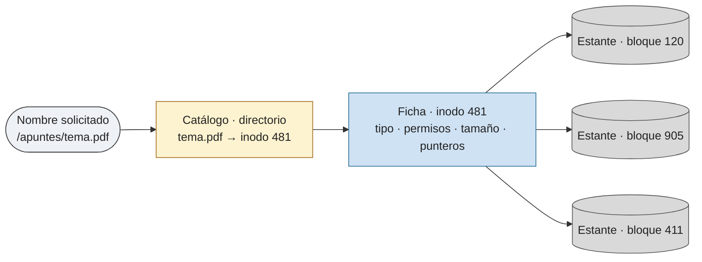
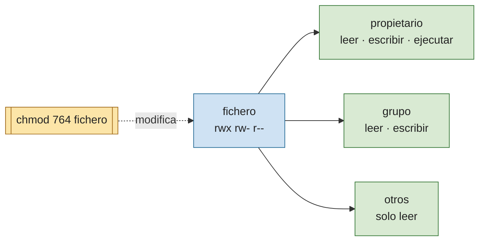

# Tema 8: Sistema de ficheros

8.1 Abstracción del sistema de ficheros · 8.2 Conceptos de fichero y directorio · 8.3 Nombrado del fichero, propietarios y permisos · 8.4 Estructura y almacenamiento del fichero · 8.5 Seguridad en los sistemas de ficheros · 8.6 Sistemas de ficheros.

---

## 8.1 Abstracción del sistema de ficheros

- Para el **usuario**, un archivo es un conjunto de datos con un nombre asociado que reside en un dispositivo de almacenamiento permanente.
- Para el **sistema operativo**, un archivo es un **tipo abstracto de datos** que permite gestionar el acceso de los procesos a los dispositivos de almacenamiento permanente.
- El archivo es la **unidad de almacenamiento** que el SO ofrece a los procesos de usuario.
- El acceso y la manipulación se realizan mediante **llamadas al sistema**. El SO puede imponer el formato de acceso a los datos (VMS, Macintosh) o no (Linux, Unix, Windows). Los sistemas de archivos hacen **transparente** el acceso a los dispositivos.

### Tipos de archivos

- Archivos **regulares**.
- **Directorios**.
- Archivos **especiales de dispositivo**: `stdin`, `stdout`, `stderr`.
- **Tuberías** (*pipes*) con nombre.
- **Enlaces simbólicos**.

Un **dispositivo RAID** es un conjunto de discos duros que actúan como una única unidad. Una **partición** es un grupo contiguo de cilindros que forman una única unidad sobre la que se sitúa un sistema de ficheros; las particiones permiten mejorar el acceso a disco, limitar el crecimiento de un sistema de ficheros y disponer de distintos sistemas operativos.

### Traducción flujo‑bloque

Un **sistema de archivos** es la estructura de datos que permite almacenar archivos en los bloques de bytes direccionables linealmente de los dispositivos. Vincula los bloques del almacenamiento para el **empaquetado** (*marshalling*) de los archivos; el **desempaquetado** (*unmarshalling*) los descompone en bloques. A este proceso se le denomina **traducción flujo‑bloque**.

<svg xmlns="http://www.w3.org/2000/svg" width="520" viewBox="0 0 640 140" font-family="sans-serif" font-size="13" role="img" aria-label="Traducción flujo-bloque entre el flujo de bytes del archivo y los bloques del dispositivo de almacenamiento">
  <rect width="640" height="140" fill="#ffffff"/>
  <rect x="10" y="45" width="190" height="50" rx="6" fill="#eef2f7" stroke="#444"/>
  <text x="105" y="66" text-anchor="middle">Flujo de bytes</text>
  <text x="105" y="82" text-anchor="middle">del archivo</text>
  <rect x="235" y="50" width="170" height="40" rx="20" fill="#cfe0f2" stroke="#3773a0"/>
  <text x="320" y="75" text-anchor="middle">Traducción flujo-bloque</text>
  <rect x="440" y="45" width="190" height="50" rx="6" fill="#eef2f7" stroke="#444"/>
  <text x="535" y="66" text-anchor="middle">Bloques del dispositivo</text>
  <text x="535" y="82" text-anchor="middle">de almacenamiento</text>
  <line x1="203" y1="70" x2="232" y2="70" stroke="#333"/>
  <path d="M203 70 l11 -4 l0 8 z" fill="#333"/>
  <path d="M232 70 l-11 -4 l0 8 z" fill="#333"/>
  <line x1="408" y1="70" x2="437" y2="70" stroke="#333"/>
  <path d="M408 70 l11 -4 l0 8 z" fill="#333"/>
  <path d="M437 70 l-11 -4 l0 8 z" fill="#333"/>
  <text x="320" y="120" text-anchor="middle" font-size="11" fill="#666">empaquetado (marshalling) / desempaquetado (unmarshalling)</text>
</svg>

- **Bajo nivel**: el SO solo provee traducción **flujo‑bloque**; la estructuración de los datos recae en las aplicaciones.
- **Alto nivel / estructurado**: el SO provee traducción **registro‑flujo**; requiere estructuras de datos específicas para el almacenamiento.

<svg xmlns="http://www.w3.org/2000/svg" width="620" viewBox="0 0 900 150" font-family="sans-serif" font-size="12" role="img" aria-label="Cadena de traducción registro-flujo-bloque: de registros a flujo y de flujo a bloques">
  <rect width="900" height="150" fill="#ffffff"/>
  <rect x="10" y="55" width="120" height="40" rx="6" fill="#eef2f7" stroke="#444"/>
  <text x="70" y="79" text-anchor="middle">Registros</text>
  <rect x="150" y="45" width="190" height="55" rx="20" fill="#ffe9c9" stroke="#a06a1a"/>
  <text x="245" y="68" text-anchor="middle" font-size="11">Traducción registro-flujo</text>
  <text x="245" y="84" text-anchor="middle" font-size="10" fill="#775">(solo alto nivel)</text>
  <rect x="365" y="55" width="100" height="40" rx="6" fill="#eef2f7" stroke="#444"/>
  <text x="415" y="79" text-anchor="middle">Flujo</text>
  <rect x="490" y="50" width="180" height="45" rx="20" fill="#cfe0f2" stroke="#3773a0"/>
  <text x="580" y="77" text-anchor="middle" font-size="11">Traducción flujo-bloque</text>
  <rect x="695" y="55" width="120" height="40" rx="6" fill="#eef2f7" stroke="#444"/>
  <text x="755" y="79" text-anchor="middle">Bloques</text>
  <g stroke="#333">
    <line x1="132" y1="75" x2="148" y2="75"/>
    <line x1="342" y1="75" x2="363" y2="75"/>
    <line x1="467" y1="75" x2="488" y2="75"/>
    <line x1="672" y1="75" x2="693" y2="75"/>
  </g>
  <g fill="#333">
    <path d="M132 75 l10 -4 l0 8 z"/><path d="M148 75 l-10 -4 l0 8 z"/>
    <path d="M342 75 l10 -4 l0 8 z"/><path d="M363 75 l-10 -4 l0 8 z"/>
    <path d="M467 75 l10 -4 l0 8 z"/><path d="M488 75 l-10 -4 l0 8 z"/>
    <path d="M672 75 l10 -4 l0 8 z"/><path d="M693 75 l-10 -4 l0 8 z"/>
  </g>
  <text x="450" y="130" text-anchor="middle" font-size="11" fill="#666">nivel alto / estructurado (registros) frente a nivel bajo (bloques)</text>
</svg>

## 8.2 Conceptos de fichero y directorio

El sistema de archivos es un **servicio** para los usuarios: acceder a los dispositivos es incómodo, requiere conocer detalles físicos, depende de direcciones físicas (no seguro) y, a nivel físico, el usuario no tiene restricciones.

**Objetivos**: proporcionar mecanismos de **nombrado y localización** de datos no volátiles; ofrecer **primitivas de acceso** cómodas e independientes de los dispositivos; proporcionar **protección y seguridad**.

**Funciones**: fiabilidad (correcto almacenamiento y recuperación) · almacenamiento **permanente** y **estructurado** · privacidad (solo usuarios autorizados) · abstracción de los dispositivos físicos · accesibilidad mediante llamadas al sistema o librerías · **compartición** (acceso concurrente de usuarios autorizados).

### Asignación de bloques

El *driver* del disco permite ver el disco como una secuencia numerada de bloques de tamaño fijo (**clusters**). La asignación se hace buscando **tasa de transferencia elevada** y **minimizar la fragmentación**.

**Asignación de bloques adyacentes (contigua):**

- Asigna a un fichero tantos bloques **consecutivos** como necesite. Solo hay que guardar la posición del primer bloque y el número de bloques.
- Sencilla, fácil de implementar y con buen rendimiento (no hay saltos de bloques en la lectura).
- **Desventajas**: se desconoce el tamaño del fichero al crearlo; si crece por encima del espacio asignado, hay que **reubicarlo** si no hay bloques consecutivos; el disco se fragmenta y requiere **compactación** periódica costosa.

**Asignación de bloques no adyacentes:**

- Asigna tantos bloques como necesite, aunque **no** estén consecutivos. Precisa controlar los bloques libres/ocupados y qué bloques pertenecen a cada fichero.
- Gran penalización si hay que realizar muchos **posicionamientos** de la cabeza (saltos entre bloques).
- **Tamaño de bloque grande**: reduce el tiempo de posicionamiento pero aumenta la fragmentación del último bloque; no útil en ficheros pequeños.
- **Tamaño de bloque reducido**: más saltos y más tiempo de posicionamiento, pero menos fragmentación del último bloque; no útil en ficheros grandes.
- Si se conoce el tamaño medio de los ficheros se puede fijar el tamaño de bloque. Tamaños usados: **1K, 2K, 4K, 8K**.

Estructuras para gestionar los bloques no adyacentes:

| Estructura | Descripción |
|-----------|-------------|
| **Mapa de bits** | Un bit por bloque: ocupado o libre. |
| **Lista de bloques libres** | Lista de punteros a bloques libres. Un bloque de disco de 1 K puede contener 512 números de bloque de 16 bits. |
| **Listas de archivo** | Las primeras palabras de cada bloque contienen la dirección del siguiente bloque. Fácil de implementar; ineficiente en acceso directo; mezcla información de control y datos. |
| **Nodos índice** | Cada archivo tiene una tabla que describe sus propiedades y la ubicación de sus bloques. La tabla puede quedarse pequeña y requerir distintos niveles de direccionamiento. |

Como plazas de aparcamiento: la asignación **contigua** ocupa plazas consecutivas (favorece el acceso rápido); la **enlazada** deja que cada plaza señale la siguiente (no exige continuidad); la **indexada** concentra todas las referencias en una estructura específica.

<svg xmlns="http://www.w3.org/2000/svg" width="620" viewBox="0 0 900 220" font-family="sans-serif" font-size="11" role="img" aria-label="Comparación de estrategias de asignación de bloques como plazas de aparcamiento: contigua, enlazada e indexada">
  <rect width="900" height="220" fill="#ffffff"/>
  <text x="140" y="20" text-anchor="middle" font-weight="bold">Contigua</text>
  <g stroke="#666" fill="#f2f2f2">
    <rect x="30" y="40" width="55" height="50"/>
    <rect x="90" y="40" width="55" height="50"/>
    <rect x="150" y="40" width="55" height="50"/>
    <rect x="210" y="40" width="55" height="50"/>
  </g>
  <g text-anchor="middle">
    <text x="57" y="70">12</text><text x="117" y="70">13</text><text x="177" y="70">14</text><text x="237" y="70">15</text>
  </g>
  <line x1="30" y1="100" x2="265" y2="100" stroke="#333"/>
  <text x="147" y="118" text-anchor="middle" font-size="10" fill="#666">plazas consecutivas</text>
  <text x="147" y="134" text-anchor="middle" font-size="10" fill="#666">(inicio + nº de plazas)</text>
  <text x="450" y="20" text-anchor="middle" font-weight="bold">Enlazada</text>
  <g stroke="#666" fill="#f2f2f2">
    <rect x="335" y="40" width="55" height="50"/>
    <rect x="420" y="40" width="55" height="50"/>
    <rect x="505" y="40" width="55" height="50"/>
    <rect x="590" y="40" width="55" height="50"/>
  </g>
  <g text-anchor="middle">
    <text x="362" y="70">4</text><text x="447" y="70">19</text><text x="532" y="70">7</text><text x="617" y="70">31</text>
  </g>
  <g stroke="#333" fill="#333">
    <line x1="390" y1="65" x2="418" y2="65"/><path d="M418 65 l-10 -4 l0 8 z"/>
    <line x1="475" y1="65" x2="503" y2="65"/><path d="M503 65 l-10 -4 l0 8 z"/>
    <line x1="560" y1="65" x2="588" y2="65"/><path d="M588 65 l-10 -4 l0 8 z"/>
  </g>
  <text x="462" y="118" text-anchor="middle" font-size="10" fill="#666">cada plaza señala la siguiente</text>
  <text x="462" y="134" text-anchor="middle" font-size="10" fill="#666">(no necesitan estar juntas)</text>
  <text x="770" y="20" text-anchor="middle" font-weight="bold">Indexada</text>
  <rect x="735" y="40" width="80" height="50" fill="#ffe9c9" stroke="#a06a1a"/>
  <text x="775" y="60" text-anchor="middle" font-size="9">índice</text>
  <text x="775" y="74" text-anchor="middle" font-size="9">4·19·7·31</text>
  <g stroke="#666" fill="#f2f2f2">
    <rect x="640" y="150" width="45" height="45"/>
    <rect x="700" y="150" width="45" height="45"/>
    <rect x="760" y="150" width="45" height="45"/>
    <rect x="820" y="150" width="45" height="45"/>
  </g>
  <g text-anchor="middle">
    <text x="662" y="177">4</text><text x="722" y="177">19</text><text x="782" y="177">7</text><text x="842" y="177">31</text>
  </g>
  <g stroke="#333">
    <line x1="755" y1="90" x2="662" y2="148"/>
    <line x1="765" y1="90" x2="722" y2="148"/>
    <line x1="785" y1="90" x2="782" y2="148"/>
    <line x1="795" y1="90" x2="842" y2="148"/>
  </g>
</svg>

*La asignación contigua favorece el acceso rápido; la enlazada evita exigir continuidad; la indexada concentra las referencias en una estructura específica.*

### Directorios

- En muchos casos son un **tipo especial de archivo**. Organizan el acceso a los ficheros y almacenan información de los archivos que agrupan.
- Evolución: un único directorio → un directorio por usuario (multiusuario) → **estructura arbórea jerárquica** (sistemas actuales).
- Rutas de acceso: **absolutas** (desde la raíz del sistema de ficheros) o **relativas** (desde el directorio de trabajo indicado en el PCB del proceso).

### Ejemplo: resolución de `/usr/ast/mbox` con nodos‑i

El sistema de ficheros funciona como una biblioteca: el nombre se busca en un catálogo (el directorio), que remite a una ficha (el inodo) con los metadatos y las referencias a los estantes (los bloques) donde están los datos.

*El nombre se almacena en el directorio; el inodo conserva los metadatos y las referencias a los bloques que contienen los datos.*

| Paso | Estructura | Contenido relevante | Resultado |
|------|-----------|---------------------|-----------|
| 1 | Directorio raíz (bloque de `/`) | `1 .` · `1 ..` · `4 bin` · `7 dev` · `14 lib` · `9 etc` · `6 usr` · `8 tmp` | la búsqueda de `usr` produce el **nodo‑i 6** |
| 2 | Nodo‑i 6 | modo · tamaño · tiempos · datos en el **bloque 132** | `/usr` está en el bloque 132 |
| 3 | Bloque 132 (directorio de `/usr`) | `6 .` · `1 ..` · `19 dick` · `30 erik` · `51 jim` · `26 ast` · `45 bal` | `/usr/ast` es el **nodo‑i 26** |
| 4 | Nodo‑i 26 | modo · tamaño · tiempos · datos en el **bloque 406** | `/usr/ast` está en el bloque 406 |
| 5 | Bloque 406 (directorio de `/usr/ast`) | `26 .` · `6 ..` · `64 grants` · `92 books` · `60 mbox` · `81 minix` · `17 src` | `/usr/ast/mbox` es el **nodo‑i 60** |

## 8.3 Nombrado del fichero, propietarios y permisos

- La mayoría de los sistemas de archivos modernos permiten asignar **permisos** (derechos de acceso) a usuarios y grupos, restringiendo o permitiendo visualización, modificación y/o ejecución.
- **UNIX, POSIX, Linux y macOS X** tienen un sistema simple para archivos individuales. POSIX especifica **listas de control de acceso (ACL)**, pero solo lo implementan ciertos sistemas.
- Las variantes de **DOS** no implementan ningún sistema de permisos.
- **Microsoft Windows**, así como VMS y OpenVMS, emplean **ACL** para un conjunto de permisos más complejo y variado.

### Notación simbólica en Linux

**Permisos**: `r` lectura · `w` escritura · `x` ejecución.

**Símbolo de tipo** (primer carácter):

| Símbolo | Tipo |
|---------|------|
| `-` | archivo regular |
| `d` | directorio |
| `b` | archivo especial de bloques |
| `c` | archivo especial de caracteres |
| `l` | enlace simbólico |
| `p` | tubo con nombre (*named pipe*) |
| `s` | socket de dominio |

Los permisos actúan como llaves diferenciadas: cada categoría de usuario (propietario, grupo, otros) recibe su propio juego de derechos de lectura, escritura y ejecución, que `chmod` modifica.

*Los permisos determinan qué operaciones puede realizar cada categoría de usuario sobre un fichero.*

## 8.4 Estructura y almacenamiento del fichero

### Primitivas de acceso

| Acceso de bajo nivel | Acceso estructurado (secuencial / orientado a registros) | Secuencial indexado |
|----------------------|---------------------------------------------------------|---------------------|
| `abrir(nombreArchivo)` | `abrir(nombreArchivo)` | `obtenerRegistro(IDArchivo, indice)` |
| `cerrar(IDArchivo)` | `cerrar(IDArchivo)` | `ponerRegistro(IDArchivo, registro)` |
| `leer(IDArchivo, bufer, longitud)` | `obtenerRegistro(IDArchivo, registro)` | `borrarRegistro(IDArchivo, indice)` |
| `escribir(IDArchivo, bufer, longitud)` | `ponerRegistro(IDArchivo, registro)` | |
| `buscar(IDArchivo, posicionArchivo)` | `buscar(IDArchivo, posicionArchivo)` | |

### Descriptor de fichero

Al acceder a un archivo, el gestor de ficheros crea una instancia de un **descriptor de fichero** que incluye: nombre · compartible · propietario · indicadores de protección · longitud · tiempo de creación · tiempo de última modificación · tiempo de último acceso · cuenta de referencias · detalles del dispositivo de almacenamiento. Para el **descriptor de archivo abierto** se añaden: bloqueos · estado actual · usuario.

### Bloques y agrupaciones

- **Bloque**: agrupación lógica de sectores de disco; **unidad de transferencia mínima** del sistema de archivos. Optimiza la eficiencia de la E/S. Todos los SO ofrecen un tamaño de bloque por defecto; el usuario puede fijarlo con el mandato **`mkfs`**.
- **Agrupación** (*cluster*): conjunto de bloques que se gestionan como una unidad lógica de almacenamiento. Con agrupaciones y bloques grandes aparece **fragmentación interna**. Unidad de asignación: `1 agrupación = X bloques`.

### Formato de las entradas de directorio

| Sistema | Estructura de la entrada (bytes) |
|---------|--------------------------------|
| **UNIX** | 2 (número del nodo‑i) + 14 (nombre del archivo) |
| **MS‑DOS** | 8 (nombre) + 3 (extensión) + 1 (atributos) + 10 (reservado) + 2 (tiempo) + 2 (fecha) + 2 (primer número de bloque) + 4 (tamaño) |

### Estructura del nodo‑i (UNIX)

El nodo‑i de un archivo contiene: nodo del archivo · número de enlaces · UID y GID del propietario · tamaño del archivo · tiempos de creación, último acceso y última modificación · **10 números de bloque del disco** (punteros **directos**) · un puntero **indirecto individual** · un puntero **indirecto doble** · un puntero **indirecto triple**.

<svg xmlns="http://www.w3.org/2000/svg" width="560" viewBox="0 0 700 400" font-family="sans-serif" font-size="12" role="img" aria-label="Nodo-i con 10 punteros directos a bloques de datos y punteros indirecto individual, doble y triple">
  <rect width="700" height="400" fill="#ffffff"/>
  <!-- nodo i -->
  <rect x="20" y="30" width="180" height="330" fill="#eef2f7" stroke="#444"/>
  <text x="110" y="22" text-anchor="middle" font-weight="bold">Nodo-i</text>
  <g font-size="10">
    <rect x="20" y="30" width="180" height="18" fill="#dbe4ee" stroke="#888"/><text x="26" y="43">metadatos: modo, enlaces, UID/GID</text>
    <rect x="20" y="48" width="180" height="18" fill="#dbe4ee" stroke="#888"/><text x="26" y="61">tamaño, tiempos</text>
  </g>
  <g font-size="10">
    <rect x="20" y="72" width="180" height="150" fill="#ffffff" stroke="#888"/>
    <text x="110" y="88" text-anchor="middle">10 punteros directos</text>
    <line x1="20" y1="96" x2="200" y2="96" stroke="#ccc"/>
  </g>
  <rect x="20" y="228" width="180" height="24" fill="#ffe9c9" stroke="#888"/><text x="26" y="244" font-size="10">indirecto individual</text>
  <rect x="20" y="252" width="180" height="24" fill="#ffd7a0" stroke="#888"/><text x="26" y="268" font-size="10">indirecto doble</text>
  <rect x="20" y="276" width="180" height="24" fill="#ffc078" stroke="#888"/><text x="26" y="292" font-size="10">indirecto triple</text>
  <!-- bloques de datos directos -->
  <g>
    <rect x="300" y="90" width="90" height="60" fill="#cfe0f2" stroke="#3773a0"/>
    <text x="345" y="80" text-anchor="middle" font-size="10">bloques de datos</text>
    <line x1="120" y1="150" x2="300" y2="120" stroke="#333"/><path d="M300 120 l-11 -1 l3 -7 z" fill="#333"/>
  </g>
  <!-- indirecto individual -->
  <g>
    <rect x="300" y="200" width="60" height="70" fill="#e8eef5" stroke="#888"/>
    <text x="330" y="192" text-anchor="middle" font-size="10">bloque de punteros</text>
    <rect x="420" y="200" width="90" height="70" fill="#cfe0f2" stroke="#3773a0"/>
    <text x="465" y="192" text-anchor="middle" font-size="10">bloques de datos</text>
    <line x1="200" y1="240" x2="300" y2="235" stroke="#333"/><path d="M300 235 l-10 -3 l1 7 z" fill="#333"/>
    <line x1="360" y1="235" x2="420" y2="235" stroke="#333"/><path d="M420 235 l-10 -3 l0 7 z" fill="#333"/>
  </g>
  <!-- indirecto doble -->
  <g>
    <rect x="300" y="290" width="45" height="60" fill="#e8eef5" stroke="#888"/>
    <rect x="380" y="290" width="45" height="60" fill="#e8eef5" stroke="#888"/>
    <rect x="470" y="290" width="90" height="60" fill="#cfe0f2" stroke="#3773a0"/>
    <text x="360" y="284" text-anchor="middle" font-size="10">2 niveles de bloques de punteros</text>
    <text x="515" y="284" text-anchor="middle" font-size="10">datos</text>
    <line x1="200" y1="264" x2="300" y2="312" stroke="#333"/><path d="M300 312 l-10 -3 l0 7 z" fill="#333"/>
    <line x1="345" y1="318" x2="380" y2="318" stroke="#333"/><path d="M380 318 l-9 -3 l0 6 z" fill="#333"/>
    <line x1="425" y1="318" x2="470" y2="318" stroke="#333"/><path d="M470 318 l-9 -3 l0 6 z" fill="#333"/>
    <line x1="200" y1="288" x2="298" y2="332" stroke="#333" stroke-dasharray="3 2"/><path d="M298 332 l-10 -3 l0 7 z" fill="#333"/>
    <text x="230" y="352" font-size="9" fill="#777">indirecto triple: 3 niveles</text>
  </g>
</svg>

### Superbloque y mapas de bits

- **Superbloque**: descripción del sistema de archivos, parámetros…
- **Mapa de bits**: un bit que indica si un recurso está ocupado o no. Hay **mapa de bits de nodos‑i** y **mapa de bits de bloques** (de datos: archivos/directorios).

### Gestión del espacio libre

| Método | Comentario |
|--------|-----------|
| **Mapas de bits** | Un bit por recurso (descriptor de archivo, bloque o agrupación): libre = 1, ocupado = 0. Fácil y sencillo; eficiente si el dispositivo no está muy lleno ni muy fragmentado. |
| **Listas de recursos libres** | Lista enlazada con todos los recursos disponibles. Ineficiente salvo para dispositivos muy llenos y fragmentados. |
| **Uso de agrupaciones** | Gestión por unidades lógicas mayores. |

### Caché de bloques

Al leer un bloque: (1) comprobar si está en la caché; si no, leerlo del dispositivo y copiarlo a la caché — si está llena, se **reemplaza** un bloque según la política. (2) Si el bloque ha sido escrito (**sucio**), se aplica la **política de escritura**.

- **Políticas de reemplazo**: FIFO · segunda oportunidad · MRU (*Most Recently Used*) · **LRU** (la más frecuente). Los bloques más usados tienden a permanecer en la caché; el uso estricto de LRU puede crear problemas de fiabilidad si el ordenador falla.
- **Políticas de escritura**:

| Política | Descripción | Compromiso |
|----------|-------------|-----------|
| **Escritura inmediata** (*write‑through*) | Se escribe cada vez que se modifica el bloque. | Sin problema de fiabilidad; reduce el rendimiento. |
| **Escritura diferida** (*write‑back*) | Solo se escribe a disco cuando el bloque se elige para reemplazo por falta de espacio. | Optimiza el rendimiento; problemas de fiabilidad. |
| **Escritura retrasada** (*delayed‑write*) | Escribe los bloques modificados a disco periódicamente. Los bloques especiales se escriben de inmediato. Hay que **desmontar** el volumen antes de extraerlo. | Compromiso entre rendimiento y fiabilidad; reduce el alcance de los daños. |
| **Escritura al cierre** (*write‑on‑close*) | Al cerrar un archivo, se vuelcan sus bloques actualizados. | |

### Puntos de montaje

- **Punto de montaje**: directorio sobre el que se monta un sistema de ficheros. No todos los ficheros del árbol están en el mismo dispositivo.
- El *kernel* guarda la información de particiones y puntos de montaje en `/proc/mounts` y `/etc/mtab`. Se consultan con `mount` y `df`. Montaje automatizado: `/etc/fstab`.

### Estructura del árbol en Linux/UNIX

- La raíz del árbol jerárquico es **`/`**. El árbol se compone de directorios que contienen ficheros.
- Todo directorio contiene al menos **`.`** (el propio directorio) y **`..`** (enlace a su directorio padre).
- Cada directorio y su contenido pueden pertenecer a un punto de montaje distinto.

## 8.6 Sistemas de ficheros

| SO | Sistemas de ficheros |
|----|----------------------|
| Unix | Unix System V, BSD |
| Linux | ext2, ext3, ext4, XFS, JFS, ReiserFS, Btrfs |
| Solaris | VxFS, QFS, UFS, ZFS |
| macOS X | HFS Plus, UFS |
| Windows | FAT16, FAT32, NTFS |

### Comparativa

| | FAT16 | FAT32 | HFS+ | ext3 | NTFS 5.0 | NTFS 6.0 | ext4 |
|---|---|---|---|---|---|---|---|
| Año de creación | 1984 | 1996 | 1998 | 1999 | 2001 | 2006 | 2006 |
| Empresa | Microsoft | Microsoft | Apple | Stephen Tweedie | Microsoft | Microsoft | Varios |
| SO inicial | MS‑DOS 3 | Windows 95 | Mac OS 8.1 | Linux 2.4.15 | Windows XP | Windows Vista | Linux 2.6.19 |
| Tamaño máx. de nombre | 8+3 | 8+3 | 255 car. UTF‑16 | 255 bytes | 255 car. | 255 car. | 256 bytes |
| Tamaño máx. de fichero | 2/4 GB | 4 GB | 8 EB | 2 TB | 16 EB | 16 EB | 16 TB |
| Tamaño máx. de partición | 2/4 GB | 2/16 TB | 8 EB | 32 TB | 16 EB | 16 EB | 1 EB |

### Sistemas de ficheros *journaled* o transaccionales

Tratan los cambios para crear, modificar o borrar un fichero como una **base de datos**, garantizando un comportamiento **transaccional** y almacenando un histórico. Propiedades **ACID**: Atomicidad, Consistencia, Aislamiento y Durabilidad.

- El **histórico** (*journal*) es una lista de transacciones que permite **reconstruir** el sistema de ficheros ante un error, devolviéndolo a su último estado consistente registrado.
- Minimiza el tiempo de recuperación y **evita** herramientas como `fsck` (solo se verifican los últimos cambios en los metadatos). Resuelve problemas de escalabilidad.
- Toda operación que modifique metadatos y datos de un archivo se **agrupa en la misma transacción**. Si el sistema falla, las acciones parcialmente realizadas se deshacen o se completan con el *log*. No se garantiza que el sistema esté **actualizado** al terminar la recuperación, sino que es **consistente**.
- Ejemplos: ReiserFS/Reiser4, ext3, ext4 (Linux) · NTFS (Windows) · UFS (Solaris) · XFS (IRIX/Linux) · JFS (Linux, IBM, OS/2, AIX) · HFS+ (macOS X).

### Sistemas de ficheros concretos

| Sistema | Características |
|---------|----------------|
| **FAT32** | Estándar de facto. Archivos individuales ≤ 4 GB; partición < 8 TB; nombrado solo con caracteres de la gramática inglesa; **sin características de seguridad**. Adecuado para unidades flash USB o discos externos, no para disco duro interno. |
| **exFAT** | Tabla de Asignación de Archivos Extendida. Similar a FAT32 pero permite archivos > 4 GB. Accesible en Linux, Windows y macOS X. |
| **NTFS** | Seguridad robusta: cifrado (**EFS**, *Encrypting File System*, con clave pública) que impide el acceso no autorizado. Admite cualquier símbolo UTF. Unidades de 40 GB a 2 TB. Grupos de archivos de 4 KB. Compresión. Permisos de usuario para archivos y carpetas. |
| **EXT3** | Transaccional (*journal*). Seguridad razonable. Compatible con EXT2. Bajo consumo de CPU. Límite del sistema de archivos: 2³² bloques. |
| **EXT4** | Transaccional. Volúmenes de hasta **1024 PiB** y ficheros de hasta **16 TiB**. Menor consumo de CPU que EXT3. Mayor velocidad de lectura/escritura. Emplea **extents** (conjuntos de bloques físicos contiguos). Permite montar sistemas EXT3. Escritura retrasada. Límite de 64 000 subdirectorios. |

**Límites de EXT3 según el tamaño de bloque:**

| Tamaño de bloque | Tamaño máximo de archivo | Tamaño máximo del sistema de ficheros |
|------------------|--------------------------|--------------------------------------|
| 1 KiB | 16 GiB | 2 TiB |
| 2 KiB | 256 GiB | 8 TiB |
| 4 KiB | 2 TiB | 16 TiB |
| 8 KiB | 2 TiB | 32 TiB |

### Virtual File System (VFS)

El **VFS** ofrece a las aplicaciones una **interfaz uniforme** de llamadas al sistema, aunque los datos estén almacenados con formatos diferentes. Bajo el **servidor de archivos** y el VFS, el **módulo organizador de archivos** integra los distintos sistemas (`ext2`, `vfat`, `reiserfs`, …, `proc`) y accede al **servidor de bloques**.

<svg xmlns="http://www.w3.org/2000/svg" width="560" viewBox="0 0 640 380" font-family="sans-serif" font-size="12" role="img" aria-label="Arquitectura en capas del VFS: procesos, servidor de archivos, VFS, módulo organizador de archivos con ext2, vfat, reiserfs y proc, y servidor de bloques">
  <rect width="640" height="380" fill="#ffffff"/>
  <text x="320" y="16" text-anchor="middle" font-size="11" fill="#555">procesos (llamadas al sistema)</text>
  <g fill="#333" stroke="#333">
    <line x1="130" y1="22" x2="130" y2="46"/><path d="M130 46 l-5 -10 l10 0 z"/>
    <line x1="260" y1="22" x2="260" y2="46"/><path d="M260 46 l-5 -10 l10 0 z"/>
    <line x1="390" y1="22" x2="390" y2="46"/><path d="M390 46 l-5 -10 l10 0 z"/>
    <line x1="510" y1="22" x2="510" y2="46"/><path d="M510 46 l-5 -10 l10 0 z"/>
  </g>
  <rect x="40" y="48" width="560" height="48" fill="#bfe0bf" stroke="#3a7a3a"/>
  <text x="320" y="77" text-anchor="middle" font-weight="bold">Servidor de archivos</text>
  <rect x="40" y="106" width="560" height="48" fill="#bcd6e6" stroke="#3773a0"/>
  <text x="320" y="135" text-anchor="middle" font-weight="bold">Sistema de Archivos Virtual (VFS)</text>
  <rect x="40" y="164" width="560" height="95" fill="#e9e0ae" stroke="#9a8a2a"/>
  <text x="320" y="182" text-anchor="middle" font-weight="bold" font-size="11">Módulo organizador de archivos</text>
  <rect x="60" y="196" width="100" height="45" fill="#cfe3c9" stroke="#5c8a52"/><text x="110" y="223" text-anchor="middle">ext2</text>
  <rect x="180" y="196" width="100" height="45" fill="#cfe3c9" stroke="#5c8a52"/><text x="230" y="223" text-anchor="middle">vfat</text>
  <rect x="300" y="196" width="110" height="45" fill="#cfe3c9" stroke="#5c8a52"/><text x="355" y="223" text-anchor="middle">reiserfs</text>
  <rect x="470" y="196" width="100" height="45" fill="#d8d8d8" stroke="#777"/><text x="520" y="223" text-anchor="middle">proc</text>
  <line x1="110" y1="241" x2="110" y2="270" stroke="#333"/>
  <line x1="230" y1="241" x2="230" y2="270" stroke="#333"/>
  <line x1="355" y1="241" x2="355" y2="270" stroke="#333"/>
  <line x1="110" y1="270" x2="355" y2="270" stroke="#333"/>
  <line x1="232" y1="270" x2="232" y2="284" stroke="#333"/>
  <path d="M232 296 l-6 -12 l12 0 z" fill="#333"/>
  <rect x="40" y="310" width="560" height="48" fill="#d9d9d9" stroke="#555"/>
  <text x="320" y="339" text-anchor="middle" font-weight="bold">Al servidor de bloques</text>
  <text x="520" y="270" text-anchor="middle" font-size="9" fill="#777">no pasa por</text>
  <text x="520" y="282" text-anchor="middle" font-size="9" fill="#777">el servidor de bloques</text>
</svg>

Visto como un adaptador universal: las aplicaciones usan siempre las mismas llamadas (`open`, `read`, `write`, `close`) y el VFS las reparte hacia el sistema de ficheros concreto (ext4, NTFS, FAT, procfs…) y, de ahí, hacia el dispositivo real.

<svg xmlns="http://www.w3.org/2000/svg" width="520" viewBox="0 0 640 320" font-family="sans-serif" font-size="12" role="img" aria-label="El VFS como adaptador: aplicaciones sobre una interfaz uniforme que reparte hacia ext4, NTFS, FAT y procfs, y de ahí a los dispositivos reales">
  <rect width="640" height="320" fill="#ffffff"/>
  <rect x="120" y="10" width="400" height="46" rx="6" fill="#eef2f7" stroke="#444"/>
  <text x="320" y="30" text-anchor="middle" font-size="11">Aplicaciones</text>
  <text x="320" y="46" text-anchor="middle" font-size="10" fill="#666">open · read · write · close</text>
  <line x1="320" y1="56" x2="320" y2="76" stroke="#333"/><path d="M320 76 l-5 -10 l10 0 z" fill="#333"/>
  <rect x="100" y="78" width="440" height="46" rx="20" fill="#cfe0f2" stroke="#3773a0"/>
  <text x="320" y="98" text-anchor="middle" font-size="11">VFS de Linux</text>
  <text x="320" y="114" text-anchor="middle" font-size="10" fill="#355">interfaz uniforme</text>
  <g stroke="#333" fill="#333">
    <line x1="160" y1="124" x2="80" y2="154"/><path d="M80 154 l10 2 l-4 9 z"/>
    <line x1="260" y1="124" x2="240" y2="154"/><path d="M240 154 l11 -1 l-2 10 z"/>
    <line x1="380" y1="124" x2="400" y2="154"/><path d="M400 154 l-11 -1 l2 10 z"/>
    <line x1="480" y1="124" x2="560" y2="154"/><path d="M560 154 l-10 2 l4 9 z"/>
  </g>
  <rect x="30"  y="156" width="100" height="40" fill="#cfe3c9" stroke="#5c8a52"/><text x="80"  y="180" text-anchor="middle">ext4</text>
  <rect x="190" y="156" width="100" height="40" fill="#cfe3c9" stroke="#5c8a52"/><text x="240" y="180" text-anchor="middle">NTFS</text>
  <rect x="350" y="156" width="100" height="40" fill="#cfe3c9" stroke="#5c8a52"/><text x="400" y="180" text-anchor="middle">FAT</text>
  <rect x="510" y="156" width="100" height="40" fill="#d8d8d8" stroke="#777"/><text x="560" y="180" text-anchor="middle">procfs</text>
  <g stroke="#333">
    <line x1="80"  y1="196" x2="80"  y2="230"/>
    <line x1="240" y1="196" x2="180" y2="230"/>
    <line x1="400" y1="196" x2="180" y2="230"/>
    <line x1="560" y1="196" x2="560" y2="230"/>
  </g>
  <g fill="#333">
    <path d="M80 230 l-5 -10 l10 0 z"/>
    <path d="M180 230 l-5 -10 l10 0 z"/>
    <path d="M560 230 l-5 -10 l10 0 z"/>
  </g>
  <rect x="20"  y="234" width="120" height="46" rx="6" fill="#eef2f7" stroke="#444"/><text x="80"  y="261" text-anchor="middle" font-size="10">Disco local</text>
  <rect x="120" y="234" width="120" height="46" rx="6" fill="#eef2f7" stroke="#444"/><text x="180" y="261" text-anchor="middle" font-size="10">Unidad externa</text>
  <rect x="500" y="234" width="120" height="46" rx="6" fill="#eef2f7" stroke="#444"/><text x="560" y="255" text-anchor="middle" font-size="10">Datos del</text><text x="560" y="269" text-anchor="middle" font-size="10">núcleo</text>
</svg>

*El sistema de ficheros virtual ofrece una interfaz uniforme aunque los datos estén almacenados con formatos diferentes.*

## 8.5 Seguridad en los sistemas de ficheros

El sistema de ficheros debe **garantizar la consistencia** de los datos y que solo los usuarios **autorizados** accedan a ellos para operaciones autorizadas (lectura, escritura, ejecución).

| Soluciones hardware | Soluciones software |
|---------------------|---------------------|
| Controladores que tratan con sectores con fallos | *Backups* (copias de respaldo) en discos y en cintas; *backups* incrementales |
| Discos con información **redundante (RAID)** | **Replicación** |

### RAID

Un **RAID** (*Redundant Array of Independent Disks*) combina varios discos que actúan como una única unidad, para mejorar el rendimiento y/o la tolerancia a fallos.

**RAID 0** (*striping*): divide los datos entre los discos.

<svg xmlns="http://www.w3.org/2000/svg" viewBox="0 0 300 220" font-family="sans-serif" font-size="12" role="img" aria-label="RAID 0: dos discos con los bloques repartidos, sin redundancia">
  <rect width="300" height="220" fill="#ffffff"/>
  <text x="150" y="18" text-anchor="middle" font-weight="bold">RAID 0</text>
  <g stroke="#666">
    <rect x="50" y="30" width="80" height="150" rx="8" fill="#f2f2f2"/>
    <rect x="170" y="30" width="80" height="150" rx="8" fill="#f2f2f2"/>
  </g>
  <g text-anchor="middle">
    <rect x="50" y="35" width="80" height="30" fill="#f6c85f"/><text x="90" y="55">A1</text>
    <rect x="50" y="65" width="80" height="30" fill="#a7d489"/><text x="90" y="85">A3</text>
    <rect x="50" y="95" width="80" height="30" fill="#7db8e0"/><text x="90" y="115">A5</text>
    <rect x="170" y="35" width="80" height="30" fill="#f6c85f"/><text x="210" y="55">A2</text>
    <rect x="170" y="65" width="80" height="30" fill="#a7d489"/><text x="210" y="85">A4</text>
    <rect x="170" y="95" width="80" height="30" fill="#7db8e0"/><text x="210" y="115">A6</text>
  </g>
  <text x="90" y="200" text-anchor="middle" font-size="11">Disco 0</text>
  <text x="210" y="200" text-anchor="middle" font-size="11">Disco 1</text>
</svg>

**RAID 1** (*mirroring*): duplica los datos en dos discos.

<svg xmlns="http://www.w3.org/2000/svg" viewBox="0 0 300 220" font-family="sans-serif" font-size="12" role="img" aria-label="RAID 1: dos discos con contenido idéntico (espejo)">
  <rect width="300" height="220" fill="#ffffff"/>
  <text x="150" y="18" text-anchor="middle" font-weight="bold">RAID 1</text>
  <g stroke="#666">
    <rect x="50" y="30" width="80" height="150" rx="8" fill="#f2f2f2"/>
    <rect x="170" y="30" width="80" height="150" rx="8" fill="#f2f2f2"/>
  </g>
  <g text-anchor="middle">
    <rect x="50" y="35" width="80" height="30" fill="#f6c85f"/><text x="90" y="55">A1</text>
    <rect x="50" y="65" width="80" height="30" fill="#a7d489"/><text x="90" y="85">A2</text>
    <rect x="50" y="95" width="80" height="30" fill="#7db8e0"/><text x="90" y="115">A3</text>
    <rect x="170" y="35" width="80" height="30" fill="#f6c85f"/><text x="210" y="55">A1</text>
    <rect x="170" y="65" width="80" height="30" fill="#a7d489"/><text x="210" y="85">A2</text>
    <rect x="170" y="95" width="80" height="30" fill="#7db8e0"/><text x="210" y="115">A3</text>
  </g>
  <text x="90" y="200" text-anchor="middle" font-size="11">Disco 0</text>
  <text x="210" y="200" text-anchor="middle" font-size="11">Disco 1 (espejo)</text>
</svg>

**RAID 5**: división a nivel de bloques con **paridad distribuida** entre todos los discos (`Xp` = bloque de paridad).

<svg xmlns="http://www.w3.org/2000/svg" viewBox="0 0 520 260" font-family="sans-serif" font-size="12" role="img" aria-label="RAID 5: cuatro discos con bloques de datos y paridad distribuida">
  <rect width="520" height="260" fill="#ffffff"/>
  <text x="260" y="18" text-anchor="middle" font-weight="bold">RAID 5</text>
  <g stroke="#666" fill="#f2f2f2">
    <rect x="30"  y="30" width="90" height="180" rx="8"/>
    <rect x="150" y="30" width="90" height="180" rx="8"/>
    <rect x="270" y="30" width="90" height="180" rx="8"/>
    <rect x="390" y="30" width="90" height="180" rx="8"/>
  </g>
  <g text-anchor="middle">
    <rect x="30"  y="35"  width="90" height="35" fill="#f6c85f"/><text x="75"  y="58">A1</text>
    <rect x="150" y="35"  width="90" height="35" fill="#f6c85f"/><text x="195" y="58">A2</text>
    <rect x="270" y="35"  width="90" height="35" fill="#f6c85f"/><text x="315" y="58">A3</text>
    <rect x="390" y="35"  width="90" height="35" fill="#e8a0a0"/><text x="435" y="58">Ap</text>
    <rect x="30"  y="72"  width="90" height="35" fill="#a7d489"/><text x="75"  y="95">B1</text>
    <rect x="150" y="72"  width="90" height="35" fill="#a7d489"/><text x="195" y="95">B2</text>
    <rect x="270" y="72"  width="90" height="35" fill="#e8a0a0"/><text x="315" y="95">Bp</text>
    <rect x="390" y="72"  width="90" height="35" fill="#a7d489"/><text x="435" y="95">B3</text>
    <rect x="30"  y="109" width="90" height="35" fill="#7db8e0"/><text x="75"  y="132">C1</text>
    <rect x="150" y="109" width="90" height="35" fill="#e8a0a0"/><text x="195" y="132">Cp</text>
    <rect x="270" y="109" width="90" height="35" fill="#7db8e0"/><text x="315" y="132">C2</text>
    <rect x="390" y="109" width="90" height="35" fill="#7db8e0"/><text x="435" y="132">C3</text>
    <rect x="30"  y="146" width="90" height="35" fill="#e8a0a0"/><text x="75"  y="169">Dp</text>
    <rect x="150" y="146" width="90" height="35" fill="#c7a3e0"/><text x="195" y="169">D1</text>
    <rect x="270" y="146" width="90" height="35" fill="#c7a3e0"/><text x="315" y="169">D2</text>
    <rect x="390" y="146" width="90" height="35" fill="#c7a3e0"/><text x="435" y="169">D3</text>
  </g>
  <g text-anchor="middle" font-size="11">
    <text x="75"  y="200">Disco 0</text><text x="195" y="200">Disco 1</text>
    <text x="315" y="200">Disco 2</text><text x="435" y="200">Disco 3</text>
  </g>
  <text x="260" y="235" text-anchor="middle" font-size="11" fill="#a05050">Xp = bloque de paridad (rota entre discos)</text>
</svg>

**Niveles de RAID:**

| Nivel | Técnica | Tolerancia a fallos | Notas |
|-------|---------|---------------------|-------|
| **RAID 0** | *Striping* (nivel de bloque) | **Ninguna** | Buen rendimiento de lectura/escritura; aprovecha toda la capacidad; discos homogéneos; si falla una unidad se pierden **todos** los datos. No para sistemas críticos. |
| **RAID 1** | *Mirroring* | 1 disco | Muy simple; buena velocidad de lectura/escritura; ante un fallo basta hacer una nueva copia; capacidad eficaz = **mitad**; el intercambio en caliente no siempre es posible. |
| **RAID 2** | *Striping* a nivel de **bit** + disco de paridad + código de **Hamming** | corrección de errores | Apenas se emplea; no atiende varias peticiones simultáneas (discos paralelos pero no independientes). |
| **RAID 3** | *Striping* a nivel de **byte** + disco de paridad dedicado | 1 disco | No se emplea; la controladora sincroniza los discos; tasas de transferencia muy altas; una petición ocupa todos los discos de datos. |
| **RAID 4** | *Striping* a nivel de **bloque** + disco de paridad dedicado | 1 disco | Mínimo 3 discos; permite varias lecturas simultáneas; el disco de paridad es el **cuello de botella**. |
| **RAID 5** | *Striping* a nivel de bloque + **paridad distribuida** | 1 disco | Mínimo 3 discos; bajo coste de redundancia; paridad normalmente por hardware; las **escrituras son costosas**. |
| **RAID 6** | RAID 5 + **segundo bloque de paridad** | 2 discos | Amplía RAID 5. |
| **RAID 0+1** | *Mirror* de *stripes* | | Matriz anidada. |
| **RAID 1+0** (RAID 10) | *Stripe* de *mirrors* | | Matriz anidada. |
| **RAID 1E**, **RAID 50**, **RAID 100** | Matrices RAID combinadas | | Configuraciones híbridas. |

Información adicional: [Seagate — modos RAID](http://www.seagate.com/es/es/manuals/network-storage/business-storage-nas-os/raid-modes/) · [Wikipedia — RAID](https://es.wikipedia.org/wiki/RAID) · [prepressure.com — RAID](https://www.prepressure.com/library/technology/raid) · [IONOS — RAID](https://www.ionos.es/digitalguide/servidores/seguridad/raid/)

---

## Material gráfico

Las figuras de este tema están integradas en el texto y catalogadas en [`TEORIA/IMAGENES.md`](../IMAGENES.md). Queda como **material fotográfico** adicional (ilustrativo): fotos de cabinas y *enclosures* RAID. Los diagramas de RAID de Wikipedia (RAID 2, 3, 4, 6, 0+1, 1+0, 1E, 50, 100) se resumen en la tabla de niveles.
