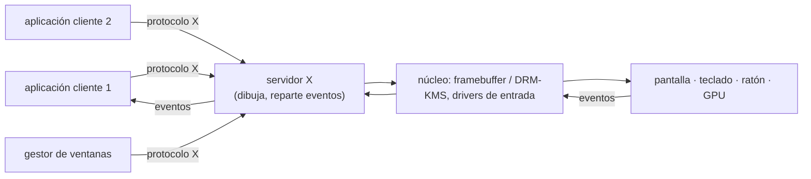
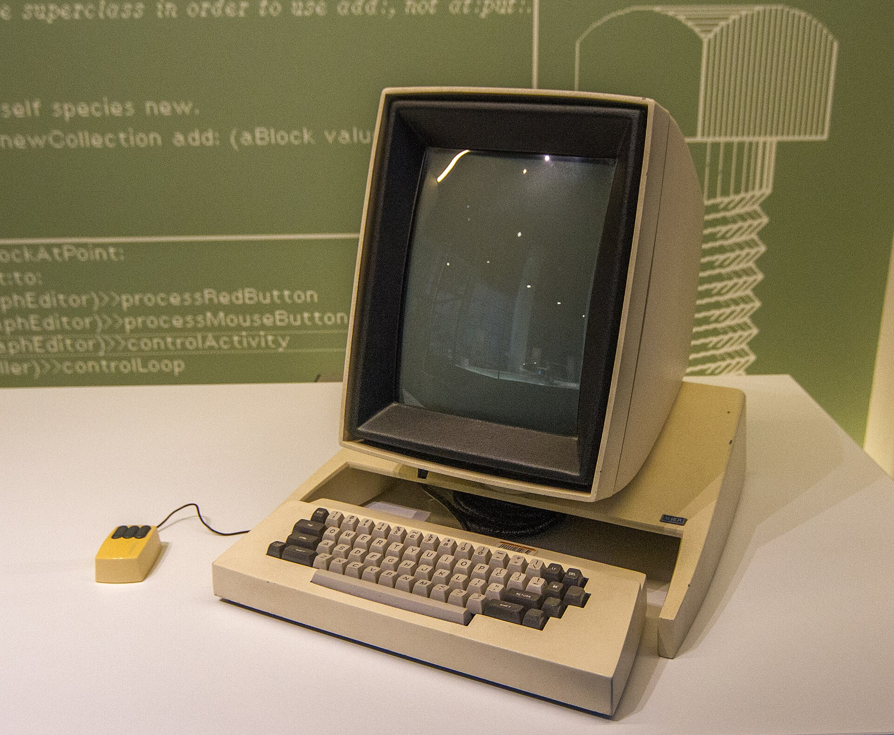
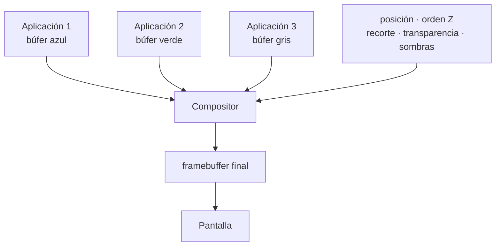
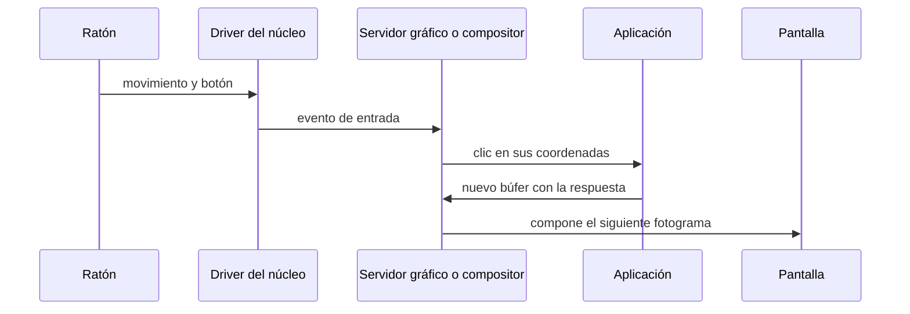
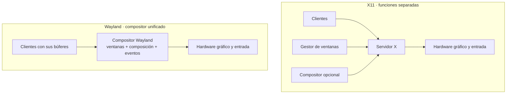

# GUI

Tema de ampliación.

## Contenidos

- Arquitectura de un entorno gráfico: servidor gráfico, gestor de ventanas, gestor de composición.
- X Window System (X11) frente a Wayland.
- Toolkits y entornos de escritorio.
- Relación con el SO: eventos de entrada, framebuffer, aceleración por GPU.

## Arquitectura de un entorno gráfico (modelo X11)

En Wayland el compositor asume el papel del servidor X y del gestor de ventanas, y cada cliente dibuja en su propio búfer.

## Galería visual complementaria

### T13.1 · El escritorio gráfico del Xerox Alto

*El Xerox Alto, desarrollado en Xerox PARC durante la década de 1970, reunió varias ideas que definirían la interacción gráfica posterior: pantalla de mapa de bits, ventanas, teclado y ratón.*

Fuente: Maksym Kozlenko, CC BY-SA 4.0, vía Wikimedia Commons. [Ficha y licencia](https://commons.wikimedia.org/wiki/File:Xerox_Alto_computer.jpg).

### T13.2 · Las ventanas como láminas compuestas

*Las aplicaciones dibujan en superficies independientes. El compositor decide su posición, orden, transparencia y presentación final.*

### T13.3 · El viaje de un clic

*Un clic atraviesa varias capas del sistema antes de convertirse en una respuesta visual.*

### T13.4 · X11 frente a Wayland

*X11 distribuye el dibujo y los eventos mediante un servidor gráfico. En Wayland, el compositor coordina directamente clientes, entrada y presentación.*

## Material

Las figuras complementarias de este tema están incluidas en la galería anterior y catalogadas en [`TEORIA/IMAGENES.md`](../IMAGENES.md).
