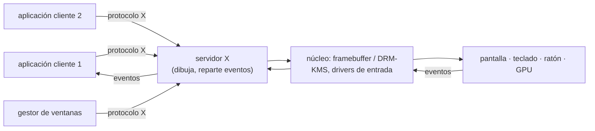

# GUI

Tema de ampliación.

## Contenidos

- Arquitectura de un entorno gráfico: servidor gráfico, gestor de ventanas, gestor de
  composición.
- X Window System (X11) frente a Wayland.
- Toolkits y entornos de escritorio.
- Relación con el SO: eventos de entrada, framebuffer, aceleración por GPU.

## Arquitectura de un entorno gráfico (modelo X11)

En Wayland el compositor asume el papel del servidor X y del gestor de ventanas, y cada
cliente dibuja en su propio búfer.

## Material

_(pendiente de añadir)_
