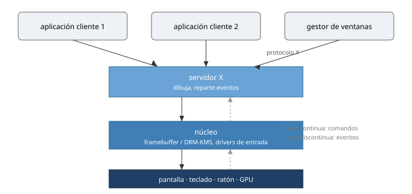
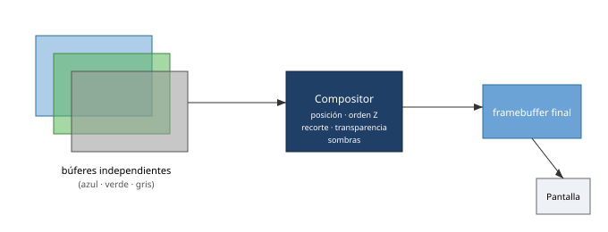
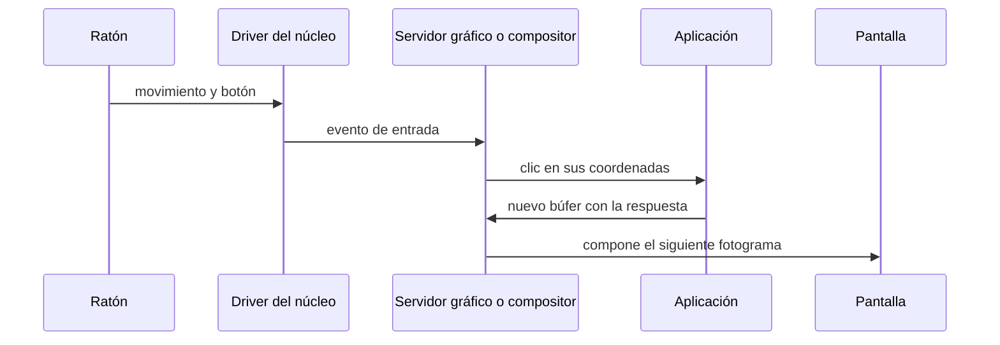
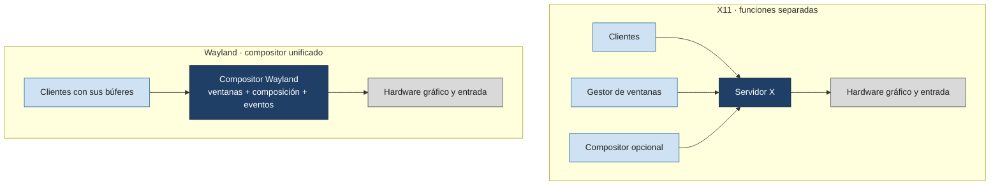

# GUI

Tema de ampliación.

## Contenidos

- Arquitectura de un entorno gráfico: servidor gráfico, gestor de ventanas, gestor de composición.
- X Window System (X11) frente a Wayland.
- Toolkits y entornos de escritorio.
- Relación con el SO: eventos de entrada, framebuffer, aceleración por GPU.

## Antecedentes: el Xerox Alto

El Xerox Alto, desarrollado en Xerox PARC durante la década de 1970, reunió varias ideas que definirían la interacción gráfica posterior: pantalla de mapa de bits, ventanas, teclado y ratón.

Fuente: Maksym Kozlenko, CC BY-SA 4.0, vía Wikimedia Commons. [Ficha y licencia](https://commons.wikimedia.org/wiki/File:Xerox_Alto_computer.jpg).

## Arquitectura de un entorno gráfico (modelo X11)

En Wayland el compositor asume el papel del servidor X y del gestor de ventanas, y cada cliente dibuja en su propio búfer.

## Composición de ventanas

Las aplicaciones dibujan en superficies independientes. El compositor decide su posición, orden Z, recorte, transparencia y sombras, y produce el framebuffer final que se envía a la pantalla.

*Las aplicaciones dibujan en superficies independientes. El compositor decide su posición, orden, transparencia y presentación final.*

## El viaje de un clic

Un clic atraviesa varias capas del sistema antes de convertirse en una respuesta visual.

*Un clic atraviesa varias capas del sistema antes de convertirse en una respuesta visual.*

## X11 frente a Wayland

X11 distribuye el dibujo y los eventos mediante un servidor gráfico con funciones separadas. En Wayland, un compositor unificado coordina directamente clientes, entrada y presentación.

*X11 distribuye el dibujo y los eventos mediante un servidor gráfico. En Wayland, el compositor coordina directamente clientes, entrada y presentación.*

Figuras catalogadas en [`TEORIA/IMAGENES.md`](../IMAGENES.md).
