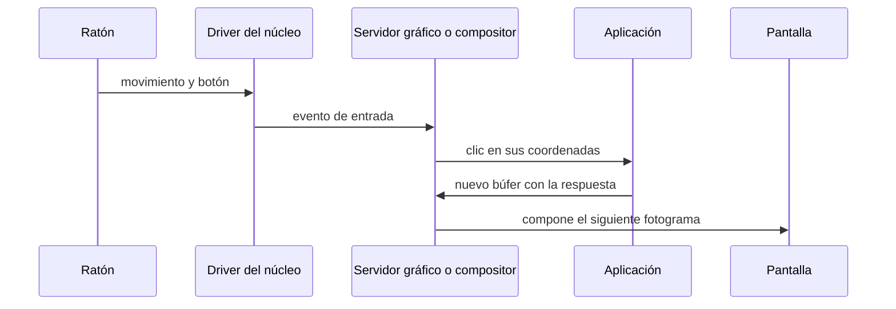
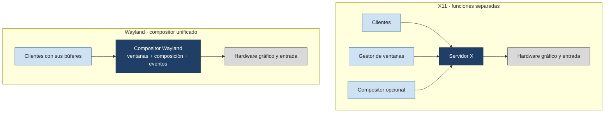

# GUI

Tema de ampliación.

## Contenidos

- Arquitectura de un entorno gráfico: servidor gráfico, gestor de ventanas, gestor de composición.
- X Window System (X11) frente a Wayland.
- Toolkits y entornos de escritorio.
- Relación con el SO: eventos de entrada, framebuffer, aceleración por GPU.

## Arquitectura de un entorno gráfico (modelo X11)

<svg xmlns="http://www.w3.org/2000/svg" viewBox="0 0 680 320" font-family="sans-serif" font-size="12" role="img" aria-label="Las aplicaciones y el gestor de ventanas hablan con el servidor X mediante el protocolo X; el servidor X se apoya en el núcleo para acceder al hardware gráfico y de entrada">
  <rect width="680" height="320" fill="#ffffff"/>
  <rect x="30" y="20" width="180" height="46" rx="6" fill="#eef2f7" stroke="#666"/><text x="120" y="48" text-anchor="middle">aplicación cliente 1</text>
  <rect x="250" y="20" width="180" height="46" rx="6" fill="#eef2f7" stroke="#666"/><text x="340" y="48" text-anchor="middle">aplicación cliente 2</text>
  <rect x="470" y="20" width="180" height="46" rx="6" fill="#eef2f7" stroke="#666"/><text x="560" y="48" text-anchor="middle">gestor de ventanas</text>
  <rect x="180" y="110" width="320" height="50" fill="#6ba3d6" stroke="#2b6f99"/><text x="340" y="132" text-anchor="middle" fill="#fff">servidor X</text><text x="340" y="148" text-anchor="middle" fill="#fff" font-size="10">dibuja, reparte eventos</text>
  <rect x="180" y="200" width="320" height="46" fill="#3f7fb5" stroke="#2b6f99"/><text x="340" y="222" text-anchor="middle" fill="#fff">núcleo</text><text x="340" y="238" text-anchor="middle" fill="#fff" font-size="10">framebuffer / DRM-KMS, drivers de entrada</text>
  <rect x="180" y="280" width="320" height="30" fill="#1f3f66" stroke="#132840"/><text x="340" y="300" text-anchor="middle" fill="#fff" font-size="11">pantalla · teclado · ratón · GPU</text>
  <line x1="120" y1="66" x2="260" y2="110" stroke="#333"/><path d="M260 110 l-10 -3 l3 -8 z" fill="#333"/>
  <line x1="340" y1="66" x2="340" y2="110" stroke="#333"/><path d="M340 110 l-4 -9 l8 0 z" fill="#333"/>
  <line x1="560" y1="66" x2="420" y2="110" stroke="#333"/><path d="M420 110 l10 -3 l-2 8 z" fill="#333"/>
  <text x="440" y="90" font-size="10" fill="#555">protocolo X</text>
  <line x1="300" y1="160" x2="300" y2="200" stroke="#333"/><path d="M300 200 l-4 -9 l8 0 z" fill="#333"/>
  <line x1="380" y1="200" x2="380" y2="160" stroke="#999" stroke-dasharray="3 3"/><path d="M380 160 l-4 8 l8 0 z" fill="#999"/>
  <line x1="300" y1="246" x2="300" y2="280" stroke="#333"/><path d="M300 280 l-4 -9 l8 0 z" fill="#333"/>
  <line x1="380" y1="280" x2="380" y2="246" stroke="#999" stroke-dasharray="3 3"/><path d="M380 246 l-4 8 l8 0 z" fill="#999"/>
  <text x="470" y="215" font-size="10" fill="#777">línea continua: comandos</text>
  <text x="470" y="230" font-size="10" fill="#777">línea discontinua: eventos</text>
</svg>

En Wayland el compositor asume el papel del servidor X y del gestor de ventanas, y cada cliente dibuja en su propio búfer.

## Galería visual complementaria

### T13.1 · El escritorio gráfico del Xerox Alto

*El Xerox Alto, desarrollado en Xerox PARC durante la década de 1970, reunió varias ideas que definirían la interacción gráfica posterior: pantalla de mapa de bits, ventanas, teclado y ratón.*

Fuente: Maksym Kozlenko, CC BY-SA 4.0, vía Wikimedia Commons. [Ficha y licencia](https://commons.wikimedia.org/wiki/File:Xerox_Alto_computer.jpg).

### T13.2 · Las ventanas como láminas compuestas

<svg xmlns="http://www.w3.org/2000/svg" viewBox="0 0 680 260" font-family="sans-serif" font-size="12" role="img" aria-label="Tres aplicaciones dibujan en búferes independientes representados como láminas superpuestas; el compositor las combina en el framebuffer final que se muestra en pantalla">
  <rect width="680" height="260" fill="#ffffff"/>
  <rect x="40" y="40" width="130" height="90" fill="#6ba3d6" fill-opacity="0.55" stroke="#2b6f99"/>
  <rect x="60" y="60" width="130" height="90" fill="#5cb85c" fill-opacity="0.55" stroke="#3d8b3d"/>
  <rect x="80" y="80" width="130" height="90" fill="#999999" fill-opacity="0.55" stroke="#555"/>
  <text x="130" y="195" text-anchor="middle" font-size="11">búferes independientes</text>
  <text x="130" y="210" text-anchor="middle" font-size="10" fill="#555">(azul · verde · gris)</text>
  <rect x="320" y="80" width="130" height="90" fill="#1f3f66" stroke="#132840"/>
  <text x="385" y="115" text-anchor="middle" fill="#fff">Compositor</text>
  <text x="385" y="132" text-anchor="middle" fill="#fff" font-size="9">posición · orden Z</text>
  <text x="385" y="146" text-anchor="middle" fill="#fff" font-size="9">recorte · transparencia</text>
  <text x="385" y="160" text-anchor="middle" fill="#fff" font-size="9">sombras</text>
  <rect x="540" y="95" width="110" height="60" fill="#6ba3d6" stroke="#2b6f99"/><text x="595" y="130" text-anchor="middle" fill="#fff" font-size="11">framebuffer final</text>
  <line x1="210" y1="115" x2="320" y2="115" stroke="#333"/><path d="M320 115 l-10 -4 l0 8 z" fill="#333"/>
  <line x1="450" y1="120" x2="540" y2="120" stroke="#333"/><path d="M540 120 l-10 -4 l0 8 z" fill="#333"/>
  <rect x="600" y="200" width="60" height="40" fill="#eef2f7" stroke="#666"/><text x="630" y="224" text-anchor="middle" font-size="10">Pantalla</text>
  <line x1="595" y1="155" x2="630" y2="200" stroke="#333"/><path d="M630 200 l-9 -4 l4 -7 z" fill="#333"/>
</svg>

*Las aplicaciones dibujan en superficies independientes. El compositor decide su posición, orden, transparencia y presentación final.*

### T13.3 · El viaje de un clic

*Un clic atraviesa varias capas del sistema antes de convertirse en una respuesta visual.*

### T13.4 · X11 frente a Wayland

*X11 distribuye el dibujo y los eventos mediante un servidor gráfico. En Wayland, el compositor coordina directamente clientes, entrada y presentación.*

## Material

Las figuras complementarias de este tema están incluidas en la galería anterior y catalogadas en [`TEORIA/IMAGENES.md`](../IMAGENES.md).
